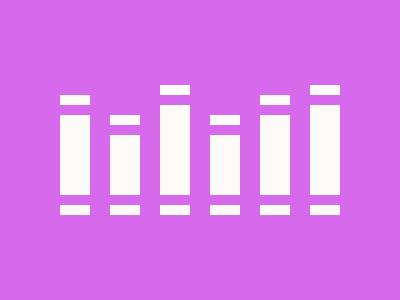
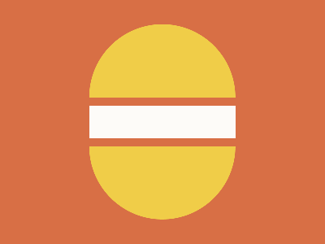

# List of all Attempts

<!-- I'm so sorry for you to see this... -->
<table>
    <caption>List of all attempts</caption>
    <thead>
        <tr>
            <th>No.</th>
            <th>Daily Target</th>
            <th>Date</th>
            <th>Atm.</th>
            <th>Score</th>
            <th>Solution</th>
        </tr>
    </thead>
    <tbody>
        <!-- <tr>
            <td colspan=6>
                <a href="README.md" style="text-align:center;display:block">Back to the README.md</a>
            </td>
        </tr> -->
        <!-- Daily Target: 12/08/2023 -->
        <tr>
            <td>001</td>
            <td rowspan=3>
                
                 
                <a href="https://cssbattle.dev/play/ZfMY6fK7bR97CcaverAc" style="font-size:small">Link to the Target</a>
            </td>
            <td>12/08/2023</td>
            <td>1</td>
            <td>601.10 {619}, 100.0% match</td>
            <td><a href="src/html/daily-target_2023-08-12_attempt-01.html">Link to the solution</a></td>
        </tr>
        <tr>
            <td>002</td>
            <td>12/08/2023</td>
            <td>2</td>
            <td>620.06 {314}, 100.0% match</td>
            <td><a href="src/html/daily-target_2023-08-12_attempt-02.html">Link to the solution</a></td>
        </tr>
        <tr>
            <td>003</td>
            <td>12/08/2023</td>
            <td>3</td>
            <td>624.50 {293}, 100.0% match</td>
            <td><a href="src/html/daily-target_2023-08-12_attempt-03.html">Link to the solution</a></td>
        </tr>
        <!-- Daily Target: 02/09/2023 -->
        <tr>
            <td>004</td>
            <td rowspan=4>
                
                 
                <a href="https://cssbattle.dev/play/eg4M4tnoJCWcAEhEBP8x" style="font-size:small">Link to the Target</a>
            </td>
            <td>02/09/2023</td>
            <td>1</td>
            <td>600.23 {784}, 100.0% match</td>
            <td><a href="src/html/daily-target_2023-09-02_attempt-01.html">Link to the solution</a></td>
        </tr>
        <tr>
            <td>005</td>
            <td>02/09/2023</td>
            <td>2</td>
            <td>601.82 {566}, 100.0% match</td>
            <td><a href="src/html/daily-target_2023-09-02_attempt-02.html">Link to the solution</a></td>
        </tr>
        <tr>
            <td>006</td>
            <td>02/09/2023</td>
            <td>3</td>
            <td>600.79 {653}, 100.0% match</td>
            <td><a href="src/html/daily-target_2023-09-02_attempt-03.html">Link to the solution</a></td>
        </tr>
        <tr>
            <td>007</td>
            <td>02/09/2023</td>
            <td>4</td>
            <td>603.71 {491}, 100.0% match</td>
            <td><a href="src/html/daily-target_2023-09-02_attempt-04.html">Link to the solution</a></td> 
        </tr>
        <!-- Daily Target: 03/09/2023 -->
        <tr>
            <td>008</td>
            <td rowspan=5>
                
                 
                <a href="https://cssbattle.dev/play/hdSQpbCiq57pJgkhBa7c" style="font-size:small">Link to the Target</a>
            </td>
            <td>03/09/2023</td>
            <td>1</td>
            <td>605.23 {455}, 100.0% match</td>
            <td><a href="src/html/daily-target_2023-09-03_attempt-01.html">Link to the solution</a></td>
        </tr>
        <tr>
            <td>009</td>
            <td>03/09/2023</td>
            <td>2</td>
            <td>610.10 {386}, 100.0% match</td>
            <td><a href="src/html/daily-target_2023-09-03_attempt-02.html">Link to the solution</a></td>
        </tr>
        <tr>
            <td>010</td>
            <td>03/09/2023</td>
            <td>3</td>
            <td>634.54 {257}, 100.0% match</td>
            <td><a href="src/html/daily-target_2023-09-03_attempt-03.html">Link to the solution</a></td>
        </tr>
        <tr>
            <td>011</td>
            <td>03/09/2023</td>
            <td>4</td>
            <td>650.56 {217}, 100.0% match</td>
            <td><a href="src/html/daily-target_2023-09-03_attempt-04.html">Link to the solution</a></td> 
        </tr>
        <tr>
            <td>012</td>
            <td>03/09/2023</td>
            <td>5</td>
            <td>692.17 {154}, 100.0% match</td>
            <td><a href="src/html/daily-target_2023-09-03_attempt-05.html">Link to the solution</a></td> 
        </tr>
        <!-- Daily Target: 04/09/2023 -->
        <tr>
            <td>013</td>
            <td rowspan=3>
                
                 
                <a href="https://cssbattle.dev/play/eOEg01X9rCpMQnXpIIXs" style="font-size:small">Link to the Target</a>
            </td>
            <td>04/09/2023</td>
            <td>1</td>
            <td>604.04 {440}, 100.0% match</td>
            <td><a href="src/html/daily-target_2023-09-04_attempt-01.html">Link to the solution</a></td>
        </tr>
        <tr>
            <td>014</td>
            <td>04/09/2023</td>
            <td>2</td>
            <td>607.52 {417}, 100.0% match</td>
            <td><a href="src/html/daily-target_2023-09-04_attempt-02.html">Link to the solution</a></td>
        </tr>
        <tr>
            <td>015</td>
            <td>04/09/2023</td>
            <td>2</td>
            <td>620.25 {313}, 100.0% match</td>
            <td><a href="src/html/daily-target_2023-09-04_attempt-02.html">Link to the solution</a></td>
        </tr>
        <!-- Daily Target: 05/09/2023 -->
        <tr>
            <td>016</td>
            <td rowspan=2>
                
                 
                <a href="https://cssbattle.dev/play/AXGhRdSBRbFCfpYCstpM" style="font-size:small">Link to the Target</a>
            </td>
            <td>05/09/2023</td>
            <td>1</td>
            <td>651.05 {216}, 100.0% match</td>
            <td><a href="src/html/daily-target_2023-09-05_attempt-01.html">Link to the solution</a></td>
        </tr>
        <tr>
            <td>017</td>
            <td>05/09/2023</td>
            <td>2</td>
            <td>714.77 {131}, 100.0% match</td>
            <td><a href="src/html/daily-target_2023-09-05_attempt-02.html">Link to the solution</a></td>
        </tr>
        <!-- Daily Target: 05/09/2023 -->
        <tr>
            <td>018</td>
            <td rowspan=3>
                
                 
                <a href="https://cssbattle.dev/play/tjqT6GqcgdL7fWFqYnqK" style="font-size:small">Link to the Target</a>
            </td>
            <td>06/09/2023</td>
            <td>1</td>
            <td>604.45 {472}, 100.0% match</td>
            <td><a href="src/html/daily-target_2023-09-06_attempt-01.html">Link to the solution</a></td>
        </tr>
        <tr>
            <td>019</td>
            <td>06/09/2023</td>
            <td>2</td>
            <td>630.51 {270}, 100.0% match</td>
            <td><a href="src/html/daily-target_2023-09-06_attempt-02.html">Link to the solution</a></td>
        </tr>
        <tr>
            <td>020</td>
            <td>06/09/2023</td>
            <td>3</td>
            <td>699.48 {146}, 100.0% match</td>
            <td><a href="src/html/daily-target_2023-09-06_attempt-03.html">Link to the solution</a></td>
        </tr>
    </tbody>
</table>

## IDE Styles
