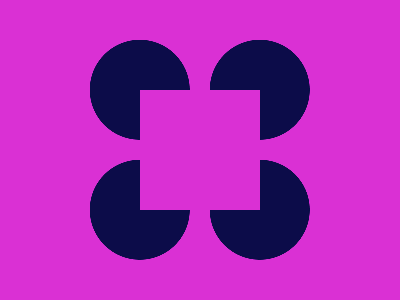

# CSSBattle - Daily Targets

<!-- - Targets played: 47
- Current streak: 45
- Longest streak: 45
- Average match: 100.00%
- Average characters: 203 -->

<!-- I'm so sorry for you to see this... -->
<table>
    <thead>
        <tr>
            <th colspan=2>My stats</th>
        </tr>
    </thead>
    <tbody>
        <tr width="1000px">
            <td width="712px">Targets played</td>
            <td width="312px" align=right>64</td>
        </tr>
        <tr>
            <td>Current streak</td>
            <td align=right>62</td>
        </tr>
        <tr>
            <td>Longest streak</td>
            <td align=right>62</td>
        </tr>
        <tr>
            <td>Average match</td>
            <td align=right>100.00%</td>
        </tr>
        <tr>
            <td>Average characters</td>
            <td align=right>200</td>
        </tr>
        <tr>
            <td>Score</td>
            <td align=right>42867.18 (Ø669.80)</td>
        </tr>
    </tbody>
</table>

<table style="width:76%!important; margin: 0 auto;">
    <thead>
        <tr>
            <th>Targets Played</th>
        </tr>
    </thead>
    <tbody>
        <tr>
            <td align=middle>
                
                
                
                
                
                
                
                
                
                
                
                
                
                
                
                
                
                
                
                
                
                
                
                
                
                
                
                
                
                
                
                
                
                
                
                
                
                
                
                
                
                
                
                
                
                
                
                
                
                
                
                
                
                
                
                
                
                
                
                
                
                
                
                
            </td>
        </tr>
    </tbody>
</table>

 

## Calendar

    

        <h3>October 2023</h3>
    

| Week | Mon | Tue | Wed | Thr | Fri | Sat | Sun |
|:-:|:-:|:-:|:-:|:-:|:-:|:-:|:-:|
| 39 | ➖                                                           | ➖                                                            | ➖                                                            | ➖                                                            | ➖                                                         | ➖                                                         |  1[✔️](src/markdown/daily-target_2023-10-01.md) |
| 40 |  2[✔️](src/markdown/daily-target_2023-10-02.md)   |  3[✔️](src/markdown/daily-target_2023-10-03.md)    |  4[✔️](src/markdown/daily-target_2023-10-04.md)    |  5[✔️](src/markdown/daily-target_2023-10-05.md)    |  6[✔️](src/markdown/daily-target_2023-10-06.md) |  7[✔️](src/markdown/daily-target_2023-10-07.md) |  8[✔️](src/markdown/daily-target_2023-10-08.md) |
| 41 |  9[✔️](src/markdown/daily-target_2023-10-09.md)   | 10[✔️](src/markdown/daily-target_2023-10-10.md)    | 11[✔️](src/markdown/daily-target_2023-10-11.md)    | 12[✔️](src/markdown/daily-target_2023-10-12.md)    | 13[✔️](src/markdown/daily-target_2023-10-13.md) | 14[✔️](src/markdown/daily-target_2023-10-14.md) | 15[✔️](src/markdown/daily-target_2023-10-15.md) |
| 42 | 16[✔️](src/markdown/daily-target_2023-10-16.md)   | 17 | 18 | 19 | 20 | 21 | 22 |
| 43 | 23 | 24 | 25 | 26 | 27 | 28 | 29 |
| 44 | 30 | 31 | ➖ | ➖ | ➖ | ➖ | ➖ |

    

        <h3>September 2023</h3>
    

| Week | Mon | Tue | Wed | Thr | Fri | Sat | Sun |
|:-:|:-:|:-:|:-:|:-:|:-:|:-:|:-:|
| 35 | ➖                                                           | ➖                                                            | ➖                                                            | ➖                                                            |  1[✔️](src/markdown/daily-target_2023-09-01.md) |  2[✔️](src/markdown/daily-target_2023-09-02.md) |  3[✔️](src/markdown/daily-target_2023-09-03.md) |
| 36 |  4[✔️](src/markdown/daily-target_2023-09-04.md)   |  5[✔️](src/markdown/daily-target_2023-09-05.md)    |  6[✔️](src/markdown/daily-target_2023-09-06.md)    |  7[✔️](src/markdown/daily-target_2023-09-07.md)    |  8[✔️](src/markdown/daily-target_2023-09-08.md) |  9[✔️](src/markdown/daily-target_2023-09-09.md) | 10[✔️](src/markdown/daily-target_2023-09-10.md) |
| 37 | 11[✔️](src/markdown/daily-target_2023-09-11.md)   | 12[✔️](src/markdown/daily-target_2023-09-12.md)    | 13[✔️](src/markdown/daily-target_2023-09-13.md)    | 14[✔️](src/markdown/daily-target_2023-09-14.md)    | 15[✔️](src/markdown/daily-target_2023-09-15.md) | 16[✔️](src/markdown/daily-target_2023-09-16.md) | 17[✔️](src/markdown/daily-target_2023-09-17.md) |
| 38 | 18[✔️](src/markdown/daily-target_2023-09-18.md)   | 19[✔️](src/markdown/daily-target_2023-09-19.md)    | 20[✔️](src/markdown/daily-target_2023-09-20.md)    | 21[✔️](src/markdown/daily-target_2023-09-21.md)    | 22[✔️](src/markdown/daily-target_2023-09-22.md) | 23[✔️](src/markdown/daily-target_2023-09-23.md) | 24[✔️](src/markdown/daily-target_2023-09-24.md) |
| 39 | 25[✔️](src/markdown/daily-target_2023-09-25.md)   | 26[✔️](src/markdown/daily-target_2023-09-26.md)    | 27[✔️](src/markdown/daily-target_2023-09-27.md)    | 28[✔️](src/markdown/daily-target_2023-09-28.md)    | 29[✔️](src/markdown/daily-target_2023-09-29.md) | 30[✔️](src/markdown/daily-target_2023-09-30.md) | ➖ |

    

        <h3>August 2023</h3>
    

| Week | Mon | Tue | Wed | Thr | Fri | Sat | Sun |
|:-:|:-:|:-:|:-:|:-:|:-:|:-:|:-:|
| 31 | ➖                                                           |  1❌                                            |  2❌                                              |  3❌                                               |  4❌                                               |  5❌                                               |  6❌                                            |
| 32 |  7❌                                              |  8❌                                            |  9❌                                              | 10❌                                               | 11❌                                               | 12[✔️](src/markdown/daily-target_2023-08-12.md)    | 13[✔️](src/markdown/daily-target_2023-08-13.md) |
| 33 | 14❌                                              | 15❌                                            | 16[✔️](src/markdown/daily-target_2023-08-16.md)   | 17[✔️](src/markdown/daily-target_2023-08-17.md)    | 18[✔️](src/markdown/daily-target_2023-08-18.md)    | 19[✔️](src/markdown/daily-target_2023-08-19.md)    | 20[✔️](src/markdown/daily-target_2023-08-20.md) |
| 34 | 21[✔️](src/markdown/daily-target_2023-08-21.md)   | 22[✔️](src/markdown/daily-target_2023-08-22.md) | 23[✔️](src/markdown/daily-target_2023-08-23.md)   | 24[✔️](src/markdown/daily-target_2023-08-24.md)    | 25[✔️](src/markdown/daily-target_2023-08-25.md)    | 26[✔️](src/markdown/daily-target_2023-08-26.md)    | 27[✔️](src/markdown/daily-target_2023-08-27.md) |
| 35 | 28[✔️](src/markdown/daily-target_2023-08-28.md)   | 29[✔️](src/markdown/daily-target_2023-08-29.md) | 30[✔️](src/markdown/daily-target_2023-08-30.md)   | 31[✔️](src/markdown/daily-target_2023-08-31.md)    | ➖                                            | ➖                                            | ➖                                            |

    

        <h2>IDE Style</h2>
    

