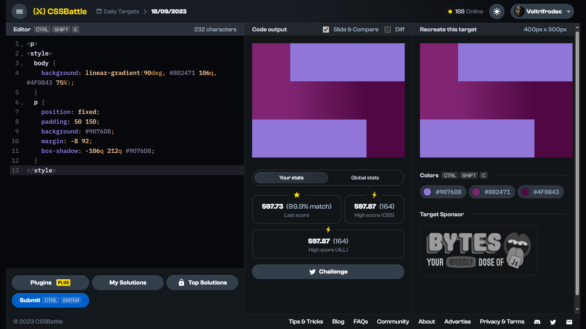

# Daily Target: 18/09/2023

[Link to the target](https://cssbattle.dev/play/x0L7nQMy9Cmd959zZbEW)



<br>

```html
<p>
<style>
  body {
    background: linear-gradient(90deg, #802471 106q, #4F0843 75%);
  }
  p {
    position: fixed;
    padding: 50 150;
    background: #9076D8;
    margin: -8 92;
    box-shadow: -106q 212q #9076D8;
  }
</style>
```

## Attempts
| Attempt | Score | Link |
|:-:|:-:|:-:|
| 1 | 597.87 {232}, 99.9% match | [Link to the solution](src/html/daily-target_2023-09-18_attempt-01.html) |
| 2 | 597.87 {164}, 99.9% match | [Link to the solution](src/html/daily-target_2023-09-18_attempt-02.html) |

<br>

## Notes
This target was pretty much impossible to make with 100.0% match, due to the problems with background gradient. So, yep, this is the day when I lost my lovely 100.0% average match.

Update (2023-09-19): CSSBattle decided that this target was indeed broken and changed the precision for 100.0% match to >= 99.8% for this target. Yaay.