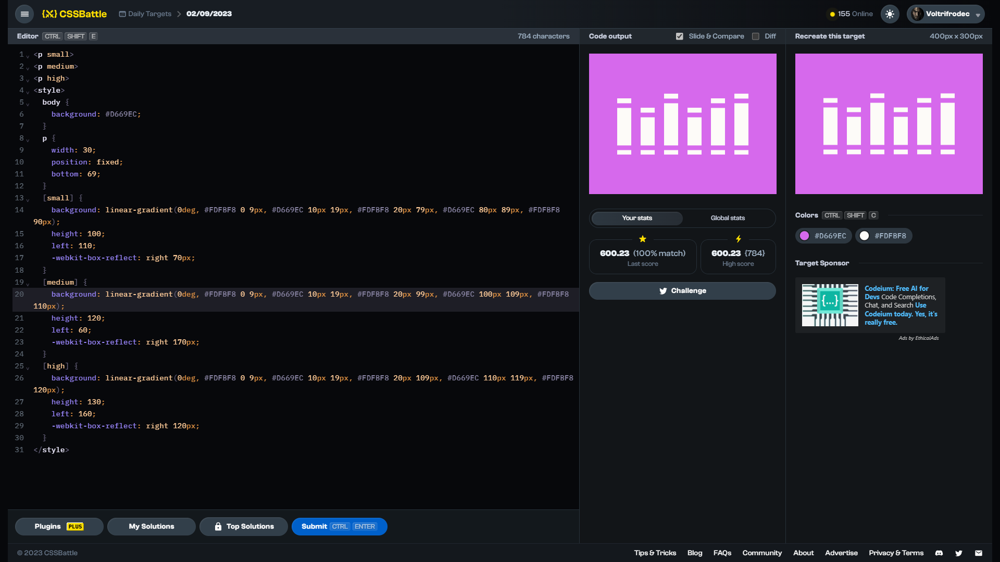

# Daily Target: 02/09/2023

[Link to the target](https://cssbattle.dev/play/eg4M4tnoJCWcAEhEBP8x)



<br>

```html
<p small>
<p medium>
<p high>
<style>
  body {
    background: #D669EC;
  }
  p {
    width: 30;
    position: fixed;
    bottom: 69;
  }
  [small] {
    background: linear-gradient(0deg, #FDFBF8 0 9px, #D669EC 10px 19px, #FDFBF8 20px 79px, #D669EC 80px 89px, #FDFBF8 90px);
    height: 100;
    left: 110;
    -webkit-box-reflect: right 70px;
  }
  [medium] {
    background: linear-gradient(0deg, #FDFBF8 0 9px, #D669EC 10px 19px, #FDFBF8 20px 99px, #D669EC 100px 109px, #FDFBF8 110px);
    height: 120;
    left: 60;
    -webkit-box-reflect: right 170px;
  }
  [high] {
    background: linear-gradient(0deg, #FDFBF8 0 9px, #D669EC 10px 19px, #FDFBF8 20px 109px, #D669EC 110px 119px, #FDFBF8 120px);
    height: 130;
    left: 160;
    -webkit-box-reflect: right 120px;
  }
</style>
```

## Attempts
| Attempt | Score | Link |
|:-:|:-:|:-:|
| 1 | 600.23 {784}, 100% match | [Link to the solution](../html/daily-target_2023-09-02_attempt-01.html) |
| 2 | 601.82 {566}, 100% match | [Link to the solution](../html/daily-target_2023-09-02_attempt-02.html) |
| 3 | 600.79 {653}, 100% match | [Link to the solution](../html/daily-target_2023-09-02_attempt-03.html) |
| 4 | 603.71 {491}, 100% match | [Link to the solution](../html/daily-target_2023-09-02_attempt-04.html) |