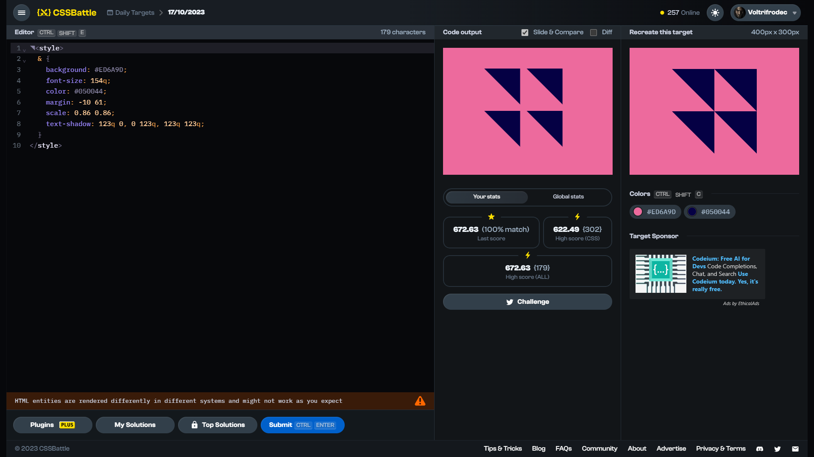

# Daily Target: 17/10/2023

[Link to the target](https://cssbattle.dev/play/I3dJrxCi5MYS6EUJYpHq)



<br>

```html
◥<style>
  & {
    background: #ED6A9D;
    font-size: 154q;
    color: #050044;
    margin: -10 61;
    scale: 0.86 0.86;
    text-shadow: 123q 0, 0 123q, 123q 123q;
  }
</style>
```

## Attempts
| Attempt | Score | Link |
|:-:|:-:|:-:|
| 1 | 622.07 {304}, 100.0% match | [Link to the solution](../html/daily-target_2023-10-17_attempt-01.html) |
| 2 | 672.63 {179}, 100.0% match | [Link to the solution](../html/daily-target_2023-10-17_attempt-02.html) |
| 3 | 692.17 {154}, 100.0% match | [Link to the solution](../html/daily-target_2023-10-17_attempt-03.html) |
| 4 | 752.75 {101}, 100.0% match | [Link to the solution](../html/daily-target_2023-10-17_attempt-04.html) |

## Other solutions

**664.78 {191}, 100.0% match** (remove white spaces)
```html
<p><p><style>
  *{
    background:#ed6a9d;
    width:0;
    height:0;
    margin:50+100;
    border-right:solid#050044+25vw;
    border-bottom:solid#0000+25vw
  }
  *>*{
    margin:0+100;
    position:fixed
  }
  p{
    margin:100 -100;
  +p{
    margin:100+0
```

## Notes
<!-- Probably reached second place with this solution (since 1st place was 96 characters, and 3rd was 106 (= also there were only 9 submissions and not 10 as usual)). Or maybe not. *mysterious music* -->