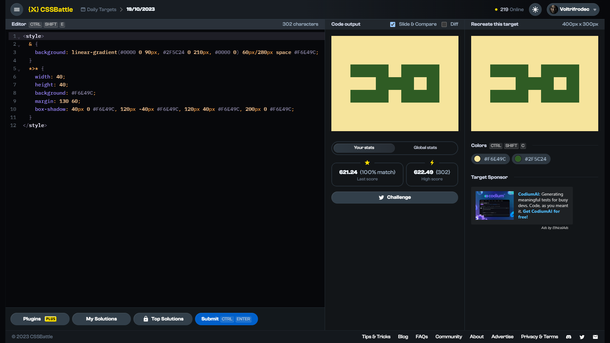

# Daily Target: 19/10/2023

[Link to the target](https://cssbattle.dev/play/RajWqlqsnLREqAnipF9a)



<br>

```html
<style>
  & {
    background: linear-gradient(#0000 0 90px, #2F5C24 0 210px, #0000 0) 60px/280px space #F6E49C;
  }
  *>* {
    width: 40;
    height: 40;
    background: #F6E49C;
    margin: 130 60;
    box-shadow: 40px 0 #F6E49C, 120px -40px #F6E49C, 120px 40px #F6E49C, 200px 0 #F6E49C;
  }
</style>
```

## Attempts
| Attempt | Score | Link |
|:-:|:-:|:-:|
| 1 | 621.24 {302}, 100.0% match | [Link to the solution](../html/daily-target_2023-10-19_attempt-01.html) |
| 2 | 633.88 {259}, 100.0% match | [Link to the solution](../html/daily-target_2023-10-19_attempt-02.html) |
| 3 | 666.66 {188}, 100.0% match | [Link to the solution](../html/daily-target_2023-10-19_attempt-03.html) |

## Other solutions

**1.)** 624.98 {291}, 100.0% match
```html
<style>
  & {
    background: #F6E49C;
    border: 5ch solid #2F5C24;
    margin: 90 220;
    height: 40;
    width: 40;
    position: fixed;
    box-shadow: -40vw 0 #2F5C24;
  }
  *>* {
    width: 200;
    background: conic-gradient(#2F5C24 50%, #F6E49C 0);
    margin: 0 -220;
  }
</style>
```