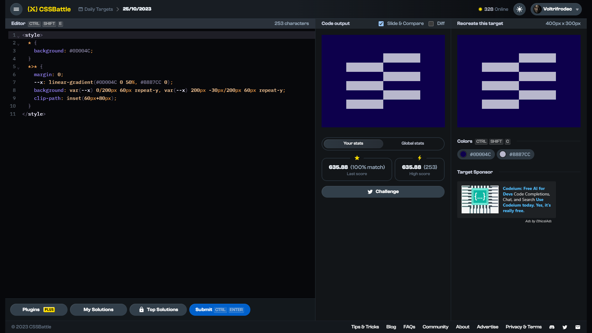

# Daily Target: 25/10/2023

[Link to the target](https://cssbattle.dev/play/V7PcxW6L8eSCfQOn49U9)



<br>

```html
<style>
  * {
    background: #0D004C;
  }
  *>* {
    margin: 0;
    --x: linear-gradient(#0D004C 0 50%, #B8B7CC 0);
    background: var(--x) 0/200px 60px repeat-y, var(--x) 200px -30px/200px 60px repeat-y;
    clip-path: inset(60px+80px);
  }
</style>
```

## Attempts
| Attempt | Score | Link |
|:-:|:-:|:-:|
| 1 | 635.88 {253}, 100.0% match | [Link to the solution](../html/daily-target_2023-10-25_attempt-01.html) |
| 2 | 645.97 {227}, 100.0% match | [Link to the solution](../html/daily-target_2023-10-25_attempt-02.html) |
| 3 | 680.66 {168}, 100.0% match | [Link to the solution](../html/daily-target_2023-10-25_attempt-03.html) |


## Other solutions

**1.)** 636.57 {251}, 100.0% match
```html
<p>
<style>
  * {
    background: #0D004C;
  }
  *>* {
    background: linear-gradient(#0D004C 0 50%, #B8B7CC 0) 0/60% 15vw repeat-y;
    clip-path: inset(25%+9ch);
  }
  p {
    clip-path: none;
    padding: 150 100;
    margin: -38 192;
  }
</style>
```
Minified version: 679.14 {170}, 100.0% match
```html
<p><style>*{background:#0d004c}p{clip-path:none;padding:150;margin:-38+192}*>*{background:linear-gradient(#0d004c,50%,#b8b7cc+0)0/60%15vw repeat-y;clip-path:inset(25%+9ch
```