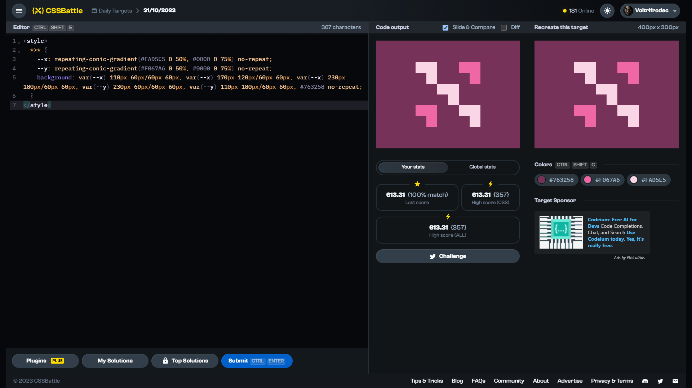

# Daily Target: 31/10/2023

[Link to the target](https://cssbattle.dev/play/DEZ0vq4BzrnHgCY7ljLv)



<br>

```html
<style>
  *>* {
    --x: repeating-conic-gradient(#FAD5E5 0 50%, #0000 0 75%) no-repeat;
    --y: repeating-conic-gradient(#F067A6 0 50%, #0000 0 75%) no-repeat;
    background: var(--x) 110px 60px/60px 60px, var(--x) 170px 120px/60px 60px, var(--x) 230px 180px/60px 60px, var(--y) 230px 60px/60px 60px, var(--y) 110px 180px/60px 60px, #763258 no-repeat;
  }
</style>
```

## Attempts
| Attempt | Score | Link |
|:-:|:-:|:-:|
| 1 | 611.99 {368}, 100.0% match | [Link to the solution](../html/daily-target_2023-10-31_attempt-01.html) |
| 2 | 618.59 {322}, 100.0% match | [Link to the solution](../html/daily-target_2023-10-31_attempt-02.html) |
| 3 | 632.00 {265}, 100.0% match | [Link to the solution](../html/daily-target_2023-10-31_attempt-03.html) |


## Other solutions

**1.)** 597.90 {150}, 99.9% match
```html
▜<style>*{background:#763258;color:#fad5e5;font:1.91rem'';margin:28 56;scale:1.01;text-shadow:124q 0 #f067a6,62q 62q,0 124q #f067a6,124q 124q}</style>

```
Minified version: ???.?? {138}, ??.?% match
```html
▜<style>*{background:#763258;color:#fad5e5;margin:28+56;scale:1.01;text-shadow:124q+0#f067a6,62q+62q,0+124q#f067a6,124q+124q;font:1.91rem'
```