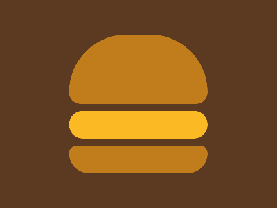

<!-- References used for creating the template file: 
    - https://stackoverflow.com/a/61088246/11557114
-->
<table>
	<thead>
		<tr>
			<td colspan=4 align="center">
				<h1>
					
				</h1>
				<h3>
					
					<br>
					<br>
					Daily Target (02/02/2024)
					<p align=center><a href="https://cssbattle.dev/play/GAYjUrKQx0ZUsPyHTYZJ"><sub>Link to the target</sub></a></p>
				</h3>
				<span>&#160;&#160;&#160;&#160;&#160;&#160;&#160;&#160;</span>
				<span>&#160;&#160;&#160;&#160;&#160;&#160;&#160;&#160;</span>
				<span>&#160;&#160;&#160;&#160;&#160;&#160;&#160;&#160;</span>
				<span>&#160;&#160;&#160;&#160;&#160;&#160;&#160;&#160;</span>
				<span>&#160;&#160;&#160;&#160;&#160;&#160;&#160;&#160;</span>
				<span>&#160;&#160;&#160;&#160;&#160;&#160;&#160;&#160;</span>
				<span>&#160;&#160;&#160;&#160;&#160;&#160;&#160;&#160;</span>
				<span>&#160;&#160;&#160;&#160;&#160;&#160;&#160;&#160;</span>
				<span>&#160;&#160;&#160;&#160;&#160;&#160;&#160;&#160;</span>
				<span>&#160;&#160;&#160;&#160;&#160;&#160;&#160;&#160;</span>
				<span>&#160;&#160;&#160;&#160;&#160;&#160;&#160;&#160;</span>
				<span>&#160;&#160;&#160;&#160;&#160;&#160;&#160;&#160;</span>
				<span>&#160;&#160;&#160;&#160;&#160;&#160;&#160;&#160;</span>
				<span>&#160;&#160;&#160;&#160;&#160;&#160;&#160;&#160;</span>
				<span>&#160;&#160;&#160;&#160;&#160;&#160;&#160;&#160;</span>
				<span>&#160;&#160;&#160;&#160;&#160;&#160;&#160;&#160;</span>
				<span>&#160;&#160;&#160;&#160;&#160;&#160;&#160;&#160;</span>
				<span>&#160;&#160;&#160;&#160;&#160;&#160;&#160;&#160;</span>
				<span>&#160;&#160;&#160;&#160;&#160;&#160;&#160;&#160;</span>
				<span>&#160;&#160;&#160;&#160;&#160;&#160;&#160;&#160;</span>
				<span>&#160;&#160;&#160;&#160;&#160;&#160;&#160;&#160;</span>
				<span>&#160;&#160;&#160;&#160;&#160;&#160;&#160;&#160;</span>
				<span>&#160;&#160;&#160;&#160;&#160;&#160;&#160;&#160;</span>
				<span>&#160;&#160;&#160;&#160;&#160;&#160;&#160;&#160;</span>
				<span>&#160;&#160;&#160;&#160;&#160;&#160;&#160;&#160;</span>
				<span>&#160;&#160;&#160;&#160;&#160;&#160;&#160;&#160;</span>
				<span>&#160;&#160;&#160;&#160;&#160;&#160;&#160;&#160;</span>
				<span>&#160;&#160;&#160;&#160;&#160;&#160;&#160;&#160;</span>
				<span>&#160;&#160;&#160;&#160;&#160;&#160;&#160;&#160;</span>
			</td>
		</tr>
		<tr>
			<th colspan=4>📅 Quick navigation</th>
		</tr>
		<tr>
			<td align="left">
				&larr;  <a href="./daily-target_2024-02-01.md">1st February 2024 ✔️</a>
			</td>
			<td align="center" colspan=2>
				<b>2nd February</b>
			</td>
			<td align="right">
				<a href="../../README.md">❌ 3rd February 2024</a> &rarr;
			</td>
		</tr>
	</thead>
	<tbody>
		<tr>
			<th colspan=4 align=center>
				Solutions
			</th>
		</tr>
		<tr>
			<th>Link</th>
			<th>Score</th>
			<th>Character count</th>
			<th>Match [%]</th>
		</tr>
		<tr align=center>
			<td>
				<a href=#solution-1>Solution 1</a>
			</td>
			<td>610.69</td><td>380</td><td>100.00</td>
		</tr>
		<tr align=center>
			<td>
				<a href=#solution-2>Solution 2</a>
			</td>
			<td>612.46</td><td>364</td><td>100.00</td>
		</tr>
		<tr align=center>
			<td>
				<a href=#solution-3>Solution 3</a>
			</td>
			<td>636.22</td><td>252</td><td>100.00</td>
		</tr>
		<tr align=center>
		<td colspan=4 bgcolor=FFAAAA id=disclaimer>

### $${\color{red} \mathrm{DISCLAIMER}}$$
**DO NOT** look at the solutions until you have solved the target, or at least spend time and try solving it on your own first. Skipping to the solution without trying won't do you any good.
I do not accept any responsibility or liability whatsoever for created consequences. I deserve the right to change any part of the file (or the repository as a whole) without notice.
<br>
You have been warned. 
		</td>
		</tr>
		<!--
    <tr align=center>
		  <td></td><td></td><td></td><td></td>
		</tr> -->
	</tbody>
</table>

# Proof of solving


# Solutions

## Solution 1
```html
<p>
<style>
  * {
    background: #5C3921;
    border: solid #C17D1B;
    border-width: 50px 100px;
    position: fixed;
    margin: 50 100;
    border-radius: 82px 82px 17px 17px;
  }
  *>* {
    border-radius: 27px 27px 82px 80px;
    border-width: 20px 100px;
    margin: 110 -100
  }
  p {
    border-color: #FBBA24;
    border-radius: 50px;
    margin: -70 -100;
  }
</style>
```

Score: 610.69 {380}, ${\color{lightgreen} 100.0\\% \space \mathrm{match}}$
<br>


## Solution 2
```html
<p>
<style>
  * {
    background: #5C3921;
    border: solid #C17D1B;
    border-width: 50 100;
    position: fixed;
    margin: 50 100;
    border-radius: 87q 87q 18q 18q;
  }
  *>* {
    border-radius: 9vh 9vh 90q 90q;
    border-width: 20 100;
    margin: 110 -100;
  }
  p {
    border-color: #FBBA24;
    border-radius: 1in;
    margin: -70 -100;
  }
</style>
```

Score: 612.46 {364}, ${\color{lightgreen} 100.0\\% \space \mathrm{match}}$
<br>


## Solution 3
```css
<p><style>*{background:#5c3921;border:solid#c17d1b;border-width:50+100;position:fixed;margin:50+100;border-radius:87q+87q+18q+18q;>*{border-radius:9vh+9vh+90q+90q;border-width:20+100;margin:110-100}p{border-color:fbba24;border-radius:1in;margin:-70-100
```

Score: 636.22 {252}, ${\color{lightgreen} 100.0\\% \space \mathrm{match}}$
<br>


## Unresolved solutions

There are no unresolved solutions for this target.

<br>

