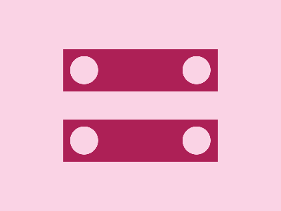
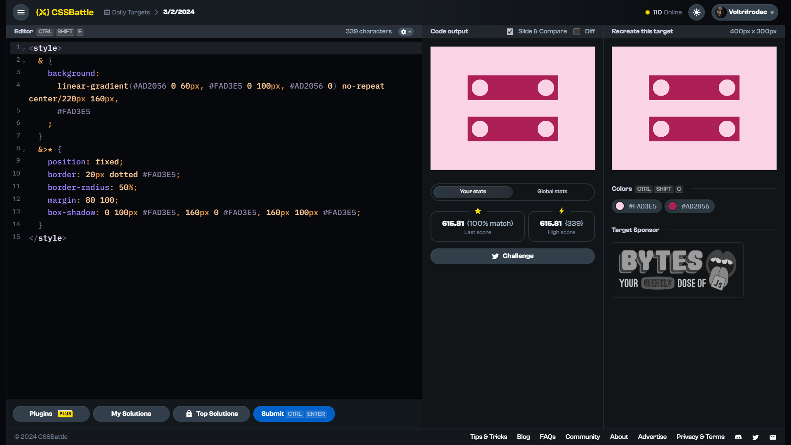

<!-- References used for creating the template file: 
    - https://stackoverflow.com/a/61088246/11557114
-->
<table>
	<thead>
		<tr>
			<td colspan=4 align="center">
				<h1>
					
				</h1>
				<h3>
					
					<br>
					<br>
					Daily Target (03/02/2024)
					<p align=center><a href="https://cssbattle.dev/play/PSGU7kutRTd3qD1Peurj"><sub>Link to the target</sub></a></p>
				</h3>
				<span>&#160;&#160;&#160;&#160;&#160;&#160;&#160;&#160;</span>
				<span>&#160;&#160;&#160;&#160;&#160;&#160;&#160;&#160;</span>
				<span>&#160;&#160;&#160;&#160;&#160;&#160;&#160;&#160;</span>
				<span>&#160;&#160;&#160;&#160;&#160;&#160;&#160;&#160;</span>
				<span>&#160;&#160;&#160;&#160;&#160;&#160;&#160;&#160;</span>
				<span>&#160;&#160;&#160;&#160;&#160;&#160;&#160;&#160;</span>
				<span>&#160;&#160;&#160;&#160;&#160;&#160;&#160;&#160;</span>
				<span>&#160;&#160;&#160;&#160;&#160;&#160;&#160;&#160;</span>
				<span>&#160;&#160;&#160;&#160;&#160;&#160;&#160;&#160;</span>
				<span>&#160;&#160;&#160;&#160;&#160;&#160;&#160;&#160;</span>
				<span>&#160;&#160;&#160;&#160;&#160;&#160;&#160;&#160;</span>
				<span>&#160;&#160;&#160;&#160;&#160;&#160;&#160;&#160;</span>
				<span>&#160;&#160;&#160;&#160;&#160;&#160;&#160;&#160;</span>
				<span>&#160;&#160;&#160;&#160;&#160;&#160;&#160;&#160;</span>
				<span>&#160;&#160;&#160;&#160;&#160;&#160;&#160;&#160;</span>
				<span>&#160;&#160;&#160;&#160;&#160;&#160;&#160;&#160;</span>
				<span>&#160;&#160;&#160;&#160;&#160;&#160;&#160;&#160;</span>
				<span>&#160;&#160;&#160;&#160;&#160;&#160;&#160;&#160;</span>
				<span>&#160;&#160;&#160;&#160;&#160;&#160;&#160;&#160;</span>
				<span>&#160;&#160;&#160;&#160;&#160;&#160;&#160;&#160;</span>
				<span>&#160;&#160;&#160;&#160;&#160;&#160;&#160;&#160;</span>
				<span>&#160;&#160;&#160;&#160;&#160;&#160;&#160;&#160;</span>
				<span>&#160;&#160;&#160;&#160;&#160;&#160;&#160;&#160;</span>
				<span>&#160;&#160;&#160;&#160;&#160;&#160;&#160;&#160;</span>
				<span>&#160;&#160;&#160;&#160;&#160;&#160;&#160;&#160;</span>
				<span>&#160;&#160;&#160;&#160;&#160;&#160;&#160;&#160;</span>
				<span>&#160;&#160;&#160;&#160;&#160;&#160;&#160;&#160;</span>
				<span>&#160;&#160;&#160;&#160;&#160;&#160;&#160;&#160;</span>
				<span>&#160;&#160;&#160;&#160;&#160;&#160;&#160;&#160;</span>
			</td>
		</tr>
		<tr>
			<th colspan=4>📅 Quick navigation</th>
		</tr>
		<tr>
			<td align="left">
				&larr;  <a href="./daily-target_2024-02-02.md">2nd February 2024 ✔️</a>
			</td>
			<td align="center" colspan=2>
				<b>3rd February</b>
			</td>
			<td align="right">
				<a href="./daily-target_2024-02-04.md">✔️ 4th February 2024</a> &rarr;
			</td>
		</tr>
	</thead>
	<tbody>
		<tr>
			<th colspan=4 align=center>
				Solutions
			</th>
		</tr>
		<tr>
			<th>Link</th>
			<th>Score</th>
			<th>Character count</th>
			<th>Match [%]</th>
		</tr>
		<tr align=center>
			<td>
				<a href=#solution-1>Solution 1</a>
			</td>
			<td>615.81</td><td>339</td><td>100.00</td>
		</tr>
		<tr align=center>
			<td>
				<a href=#solution-2>Solution 2</a>
			</td>
			<td>619.13</td><td>319</td><td>100.00</td>
		</tr>
		<tr align=center>
			<td>
				<a href=#solution-3>Solution 3</a>
			</td>
			<td>653.03</td><td>212</td><td>100.00</td>
		</tr>
		<tr align=center>
		<td colspan=4 bgcolor=FFAAAA id=disclaimer>

### $${\color{red} \mathrm{DISCLAIMER}}$$
**DO NOT** look at the solutions until you have solved the target, or at least spend time and try solving it on your own first. Skipping to the solution without trying won't do you any good.
I do not accept any responsibility or liability whatsoever for created consequences. I deserve the right to change any part of the file (or the repository as a whole) without notice.
<br>
You have been warned. 
		</td>
		</tr>
		<!--
    <tr align=center>
		  <td></td><td></td><td></td><td></td>
		</tr> -->
	</tbody>
</table>

# Proof of solving


# Solutions

## Solution 1
```html
<style>
  & {
    background:
      linear-gradient(#AD2056 0 60px, #FAD3E5 0 100px, #AD2056 0) no-repeat center/220px 160px,
      #FAD3E5
    ;
  }
  &>* {
    position: fixed;
    border: 20px dotted #FAD3E5;
    border-radius: 50%;
    margin: 80 100;
    box-shadow: 0 100px #FAD3E5, 160px 0 #FAD3E5, 160px 100px #FAD3E5;
  }
</style>
```

Score: 615.81 {339}, ${\color{lightgreen} 100.0\\% \space \mathrm{match}}$
<br>


## Solution 2
```html
<style>
  & {
    background:
      linear-gradient(#AD2056 60px, #0000 0 25vw, #AD2056 0) space 50%/55% 10pc,
      #FAD3E5
    ;
  }
  &>* {
    position: fixed;
    border: 5vw dotted #FAD3E5;
    border-radius: 50%;
    margin: 80 100;
    box-shadow: 0 106q #FAD3E5, 10pc 0 #FAD3E5, 10pc 106q #FAD3E5;
  }
</style>
```

Score: 619.13 {319}, ${\color{lightgreen} 100.0\\% \space \mathrm{match}}$
<br>


## Solution 3
```css
<style>&{background:linear-gradient(#ad2056,60px,#0000+0,25vw,#ad2056+0) space#fad3e5+50%/55%10pc;color:FAD3E5;>*{position:fixed;border:solid+5vw;border-radius:50%;margin:80+100;box-shadow:0+106q,10pc+0,10pc+106q
```

Score: 653.03 {212}, ${\color{lightgreen} 100.0\\% \space \mathrm{match}}$
<br>


## Other solutions

There are no other solutions for this target.

<br>