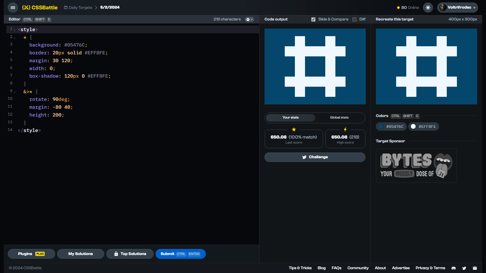

<!-- References used for creating the template file: 
    - https://stackoverflow.com/a/61088246/11557114
-->
<table>
	<thead>
		<tr>
			<td colspan=4 align="center">
				<h1>
					
				</h1>
				<h3>
					
					<br>
					<br>
					Daily Target (05/02/2024)
					<p align=center><a href="https://cssbattle.dev/play/naMendyb7Xm2WiV7FJvF"><sub>Link to the target</sub></a></p>
				</h3>
				<span>&#160;&#160;&#160;&#160;&#160;&#160;&#160;&#160;</span>
				<span>&#160;&#160;&#160;&#160;&#160;&#160;&#160;&#160;</span>
				<span>&#160;&#160;&#160;&#160;&#160;&#160;&#160;&#160;</span>
				<span>&#160;&#160;&#160;&#160;&#160;&#160;&#160;&#160;</span>
				<span>&#160;&#160;&#160;&#160;&#160;&#160;&#160;&#160;</span>
				<span>&#160;&#160;&#160;&#160;&#160;&#160;&#160;&#160;</span>
				<span>&#160;&#160;&#160;&#160;&#160;&#160;&#160;&#160;</span>
				<span>&#160;&#160;&#160;&#160;&#160;&#160;&#160;&#160;</span>
				<span>&#160;&#160;&#160;&#160;&#160;&#160;&#160;&#160;</span>
				<span>&#160;&#160;&#160;&#160;&#160;&#160;&#160;&#160;</span>
				<span>&#160;&#160;&#160;&#160;&#160;&#160;&#160;&#160;</span>
				<span>&#160;&#160;&#160;&#160;&#160;&#160;&#160;&#160;</span>
				<span>&#160;&#160;&#160;&#160;&#160;&#160;&#160;&#160;</span>
				<span>&#160;&#160;&#160;&#160;&#160;&#160;&#160;&#160;</span>
				<span>&#160;&#160;&#160;&#160;&#160;&#160;&#160;&#160;</span>
				<span>&#160;&#160;&#160;&#160;&#160;&#160;&#160;&#160;</span>
				<span>&#160;&#160;&#160;&#160;&#160;&#160;&#160;&#160;</span>
				<span>&#160;&#160;&#160;&#160;&#160;&#160;&#160;&#160;</span>
				<span>&#160;&#160;&#160;&#160;&#160;&#160;&#160;&#160;</span>
				<span>&#160;&#160;&#160;&#160;&#160;&#160;&#160;&#160;</span>
				<span>&#160;&#160;&#160;&#160;&#160;&#160;&#160;&#160;</span>
				<span>&#160;&#160;&#160;&#160;&#160;&#160;&#160;&#160;</span>
				<span>&#160;&#160;&#160;&#160;&#160;&#160;&#160;&#160;</span>
				<span>&#160;&#160;&#160;&#160;&#160;&#160;&#160;&#160;</span>
				<span>&#160;&#160;&#160;&#160;&#160;&#160;&#160;&#160;</span>
				<span>&#160;&#160;&#160;&#160;&#160;&#160;&#160;&#160;</span>
				<span>&#160;&#160;&#160;&#160;&#160;&#160;&#160;&#160;</span>
				<span>&#160;&#160;&#160;&#160;&#160;&#160;&#160;&#160;</span>
				<span>&#160;&#160;&#160;&#160;&#160;&#160;&#160;&#160;</span>
			</td>
		</tr>
		<tr>
			<th colspan=4>📅 Quick navigation</th>
		</tr>
		<tr>
			<td align="left">
				&larr;  <a href="./daily-target_2024-02-03.md">4th February 2024 ✔️</a>
			</td>
			<td align="center" colspan=2>
				<b>5th February</b>
			</td>
			<td align="right">
				<a href="../../README.md">❌ 6th February 2024</a> &rarr;
			</td>
		</tr>
	</thead>
	<tbody>
		<tr>
			<th colspan=4 align=center>
				Solutions
			</th>
		</tr>
		<tr>
			<th>Link</th>
			<th>Score</th>
			<th>Character count</th>
			<th>Match [%]</th>
		</tr>
		<tr align=center>
			<td>
				<a href=#solution-1>Solution 1</a>
			</td>
			<td>650.08</td><td>218</td><td>100.00</td>
		</tr>
		<tr align=center>
			<td>
				<a href=#solution-2>Solution 2</a>
			</td>
			<td>707.36</td><td>138</td><td>100.00</td>
		</tr>
		<tr align=center>
		<td colspan=4 bgcolor=FFAAAA id=disclaimer>

### $${\color{red} \mathrm{DISCLAIMER}}$$
**DO NOT** look at the solutions until you have solved the target, or at least spend time and try solving it on your own first. Skipping to the solution without trying won't do you any good.
I do not accept any responsibility or liability whatsoever for created consequences. I deserve the right to change any part of the file (or the repository as a whole) without notice.
<br>
You have been warned. 
		</td>
		</tr>
		<!--
    <tr align=center>
		  <td></td><td></td><td></td><td></td>
		</tr> -->
	</tbody>
</table>

# Proof of solving


# Solutions

## Solution 1
```html
<style>
  * {
    background: #05476C;
    border: 20px solid #EFF8FE;
    margin: 30 120;
    width: 0;
    box-shadow: 120px 0 #EFF8FE;
  }
  &>* {
    rotate: 90deg;
    margin: -80 40;
    height: 200;
  }
</style>
```

Score: 650.08 {218}, ${\color{lightgreen} 100.0\\% \space \mathrm{match}}$
<br>


## Solution 2
```css
<style>*{background:#05476c;color:eff8fe;border:solid+5vw;margin:30+120;width:0;box-shadow:30vw+0;>*{rotate:90deg;margin:-80+40;height:200
```

Score: 707.36 {138}, ${\color{lightgreen} 100.0\\% \space \mathrm{match}}$
<br>


## Unresolved solutions

There are no unresolved solutions for this target.

<br>

