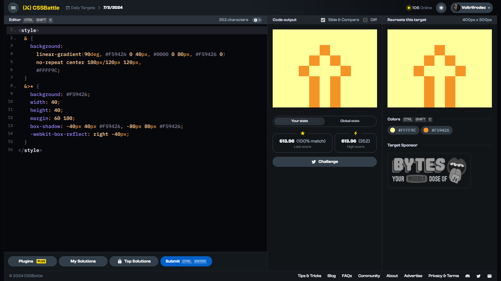

<!-- References used for creating the template file: 
    - https://stackoverflow.com/a/61088246/11557114
-->
<table>
	<thead>
		<tr>
			<td colspan=4 align="center">
				<h1>
					
				</h1>
				<h3>
					
					<br>
					<br>
					Daily Target (07/02/2024)
					<p align=center><a href="https://cssbattle.dev/play/o6kFFgv87WAZGd8BM4UH"><sub>Link to the target</sub></a></p>
				</h3>
				<span>&#160;&#160;&#160;&#160;&#160;&#160;&#160;&#160;</span>
				<span>&#160;&#160;&#160;&#160;&#160;&#160;&#160;&#160;</span>
				<span>&#160;&#160;&#160;&#160;&#160;&#160;&#160;&#160;</span>
				<span>&#160;&#160;&#160;&#160;&#160;&#160;&#160;&#160;</span>
				<span>&#160;&#160;&#160;&#160;&#160;&#160;&#160;&#160;</span>
				<span>&#160;&#160;&#160;&#160;&#160;&#160;&#160;&#160;</span>
				<span>&#160;&#160;&#160;&#160;&#160;&#160;&#160;&#160;</span>
				<span>&#160;&#160;&#160;&#160;&#160;&#160;&#160;&#160;</span>
				<span>&#160;&#160;&#160;&#160;&#160;&#160;&#160;&#160;</span>
				<span>&#160;&#160;&#160;&#160;&#160;&#160;&#160;&#160;</span>
				<span>&#160;&#160;&#160;&#160;&#160;&#160;&#160;&#160;</span>
				<span>&#160;&#160;&#160;&#160;&#160;&#160;&#160;&#160;</span>
				<span>&#160;&#160;&#160;&#160;&#160;&#160;&#160;&#160;</span>
				<span>&#160;&#160;&#160;&#160;&#160;&#160;&#160;&#160;</span>
				<span>&#160;&#160;&#160;&#160;&#160;&#160;&#160;&#160;</span>
				<span>&#160;&#160;&#160;&#160;&#160;&#160;&#160;&#160;</span>
				<span>&#160;&#160;&#160;&#160;&#160;&#160;&#160;&#160;</span>
				<span>&#160;&#160;&#160;&#160;&#160;&#160;&#160;&#160;</span>
				<span>&#160;&#160;&#160;&#160;&#160;&#160;&#160;&#160;</span>
				<span>&#160;&#160;&#160;&#160;&#160;&#160;&#160;&#160;</span>
				<span>&#160;&#160;&#160;&#160;&#160;&#160;&#160;&#160;</span>
				<span>&#160;&#160;&#160;&#160;&#160;&#160;&#160;&#160;</span>
				<span>&#160;&#160;&#160;&#160;&#160;&#160;&#160;&#160;</span>
				<span>&#160;&#160;&#160;&#160;&#160;&#160;&#160;&#160;</span>
				<span>&#160;&#160;&#160;&#160;&#160;&#160;&#160;&#160;</span>
				<span>&#160;&#160;&#160;&#160;&#160;&#160;&#160;&#160;</span>
				<span>&#160;&#160;&#160;&#160;&#160;&#160;&#160;&#160;</span>
				<span>&#160;&#160;&#160;&#160;&#160;&#160;&#160;&#160;</span>
				<span>&#160;&#160;&#160;&#160;&#160;&#160;&#160;&#160;</span>
			</td>
		</tr>
		<tr>
			<th colspan=4>📅 Quick navigation</th>
		</tr>
		<tr>
			<td align="left">
				&larr;  <a href="./daily-target_2024-02-06.md">6th February 2024 ✔️</a>
			</td>
			<td align="center" colspan=2>
				<b>7th February</b>
			</td>
			<td align="right">
				<a href="./daily-target_2024-02-08.md">✔️ 8th February 2024</a> &rarr;
			</td>
		</tr>
	</thead>
	<tbody>
		<tr>
			<th colspan=4 align=center>
				Solutions
			</th>
		</tr>
		<tr>
			<th>Link</th>
			<th>Score</th>
			<th>Character count</th>
			<th>Match [%]</th>
		</tr>
		<tr align=center>
			<td>
				<a href=#solution-1>Solution 1</a>
			</td>
			<td>613.96</td><td>352</td><td>100.00</td>
		</tr>
		<tr align=center>
			<td>
				<a href=#solution-2>Solution 2</a>
			</td>
			<td>619.13</td><td>319</td><td>100.00</td>
		</tr>
		<tr align=center>
			<td>
				<a href=#solution-3>Solution 3</a>
			</td>
			<td>653.54</td><td>211</td><td>100.00</td>
		</tr>
		<tr align=center>
		<td colspan=4 bgcolor=FFAAAA id=disclaimer>

### $${\color{red} \mathrm{DISCLAIMER}}$$
**DO NOT** look at the solutions until you have solved the target, or at least spend time and try solving it on your own first. Skipping to the solution without trying won't do you any good.
I do not accept any responsibility or liability whatsoever for created consequences. I deserve the right to change any part of the file (or the repository as a whole) without notice.
<br>
You have been warned. 
		</td>
		</tr>
		<!--
    <tr align=center>
		  <td></td><td></td><td></td><td></td>
		</tr> -->
	</tbody>
</table>

# Proof of solving


# Solutions

## Solution 1
```html
<style>
  & {
    background: 
      linear-gradient(90deg, #F59426 0 40px, #0000 0 80px, #F59426 0)
      no-repeat center 180px/120px 120px,
      #FFFF9C;
  }
  &>* {
    background: #F59426;
    width: 40;
    height: 40;
    margin: 60 180;
    box-shadow: -40px 40px #F59426, -80px 80px #F59426;
    -webkit-box-reflect: right -40px;
  }
</style>
```

Score: 613.96 {352}, ${\color{lightgreen} 100.0\\% \space \mathrm{match}}$
<br>


## Solution 2
```html
<style>
  & {
    background: 
      linear-gradient(90deg, #F59426 5ch, #0000 0 5pc, #F59426 0)
      no-repeat 50% 100%/30% 40%,
      #FFFF9C;
  }
  &>* {
    background: #F59426;
    width: 40;
    height: 40;
    margin: 60 180;
    color: F59426;
    box-shadow: -5ch 5ch, -5pc 5pc, 5ch 5ch, 5pc 5pc;
  }
</style>
```

Score: 619.13 {319}, ${\color{lightgreen} 100.0\\% \space \mathrm{match}}$
<br>


## Solution 3
```css
<style>&{background:linear-gradient(90deg,#f59426,5ch,#0000+0,5pc,#f59426+0)no-repeat#ffff9c+50%100%/30%40%;>*{background:#f59426;height:40;margin:60+180;color:F59426;box-shadow:-5ch+5ch,-5pc+5pc,5ch+5ch,5pc+5pc
```

Score: 653.54 {211}, ${\color{lightgreen} 100.0\\% \space \mathrm{match}}$
<br>


## Unresolved solutions

There are no unresolved solutions for this target.

<br>

