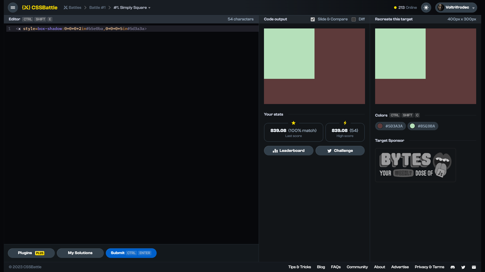

# Target #1: Simply Square

[Link to the target](https://cssbattle.dev/play/1)



<br>

```html
<body bgcolor=5d3a3a text=B5E0BA><x style=box-shadow:0+0+0+2in>
```


## Attempts
| Attempt | Score | Link |
|:-:|:-:|:-:|
| 1 | 783.08 {082}, 100% match | [Link to the solution]() |
| 2 | 834.56 {056}, 100% match | [Link to the solution]() |
| 3 | 839.08 {054}, 100% match | [Link to the solution]() |