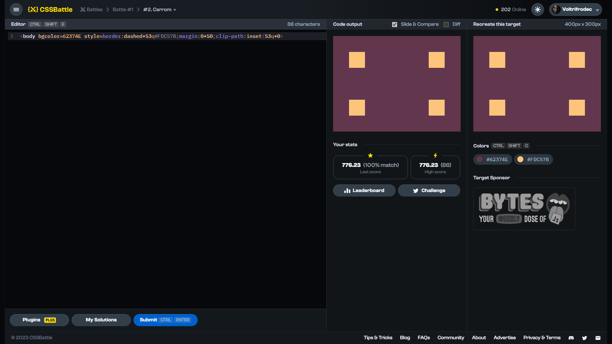

# Target #2: Carrom

[Link to the target](https://cssbattle.dev/play/2)



<br>

```html
<body bgcolor=62374E style=border:dashed+53q#FDC57B;margin:0+50;clip-path:inset(53q+0>
```

<br>

```html
<body bgcolor=62374E style=width:200;height:100;margin:50;border:solid+53q;border-image:conic-gradient(#FDC57B,#FDC57B)150>
```


## Attempts
| Attempt | Score | Link |
|:-:|:-:|:-:|
| 1 | 621.44 {307}, 100% match | [Link to the solution](/001-pilot-battle/src/html/002_carrom_attempt-01.html) |
| 2 | 768.03 {091}, 100% match | [Link to the solution](/001-pilot-battle/src/html/002_carrom_attempt-02.html) |
| 3 | 776.23 {086}, 100% match | [Link to the solution](/001-pilot-battle/src/html/002_carrom_attempt-03.html) |