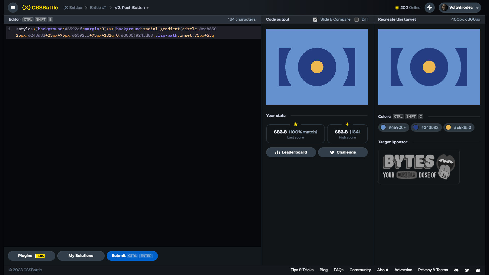

# Target #3: Push Button

[Link to the target](https://cssbattle.dev/play/3)



<br>

```html
<style>*{background:#6592cf;margin:0}*>*{background:radial-gradient(circle,#eeb850 25px,#243d83+25px+75px,#6592cf+75px+132q,0,#0000)#243d83;clip-path:inset(75px+53q
```


## Attempts
| Attempt | Score | Link |
|:-:|:-:|:-:|
| 1 | 607.37 {419}, 100% match | [Link to the solution]() |
| 2 | 643.00 {234}, 100% match | [Link to the solution]() |
| 3 | 683.80 {164}, 100% match | [Link to the solution]() |