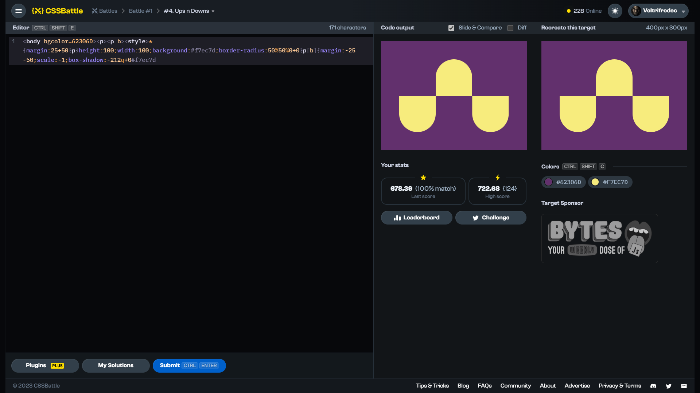

# Target #4: Ups n Downs

[Link to the target](https://cssbattle.dev/play/4)



<br>

```html
<body bgcolor=62306D><p><p b><style>*{margin:25+50}p{height:100;width:100;background:#f7ec7d;border-radius:50%50%0+0}p[b]{margin:-25 -50;scale:-1;box-shadow:-212q+0#f7ec7d
```


## Attempts
| Attempt | Score | Link |
|:-:|:-:|:-:|
| 1 | 604.89 {462}, 100% match | [Link to the solution](/001-pilot-battle/src/html/004_ups-n-downs_attempt-01.html) |
| 2 | 615.96 {338}, 100% match | [Link to the solution](/001-pilot-battle/src/html/004_ups-n-downs_attempt-02.html) |
| 3 | 624.74 {292}, 100% match | [Link to the solution](/001-pilot-battle/src/html/004_ups-n-downs_attempt-03.html) |
| 4 | 632.62 {263}, 100% match | [Link to the solution](/001-pilot-battle/src/html/004_ups-n-downs_attempt-04.html) |
| 5 | 678.39 {171}, 100% match | [Link to the solution](/001-pilot-battle/src/html/004_ups-n-downs_attempt-05.html) |
| 6 | 722.68 {124}, 100% match | Not Available<sup>1</sup> |

<sup>1</sup> - I've tried to solve a target based on solution made by someone else, but ended up with literally the same thing, so I didn't upload it here.