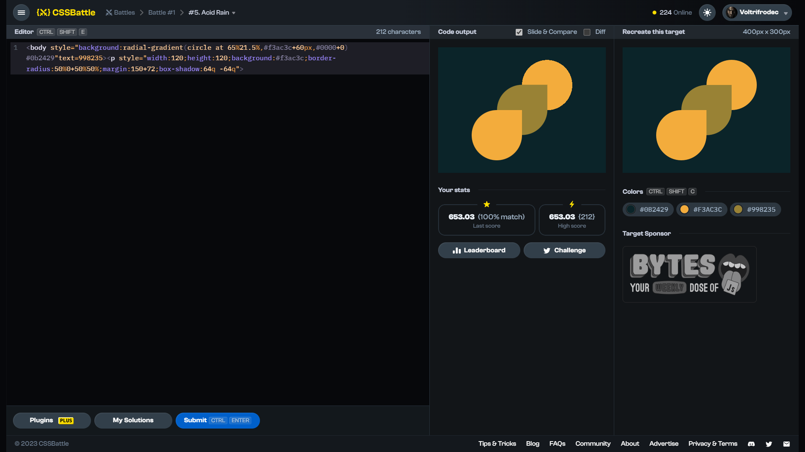

# Target #5: Acid Rain

[Link to the target](https://cssbattle.dev/play/5)



<br>

```html
<body style="background:radial-gradient(circle at 65%21.5%,#f3ac3c+60px,#0000+0) #0b2429"text=998235><p style="width:120;height:120;background:#f3ac3c;border-radius:50%0+50%50%;margin:150+72;box-shadow:64q -64q">
```


## Attempts
| Attempt | Score | Link |
|:-:|:-:|:-:|
| 1 | 604.89 {462}, 100% match | [Link to the solution]() |
| 2 | 615.96 {338}, 100% match | [Link to the solution]() |
| 3 | 624.74 {292}, 100% match | [Link to the solution]() |
| 4 | 632.62 {263}, 100% match | [Link to the solution]() |
| 5 | 625.07 {288}, 100% match | [Link to the solution]() |
| 6 | 653.03 {212}, 100% match | [Link to the solution]() |
