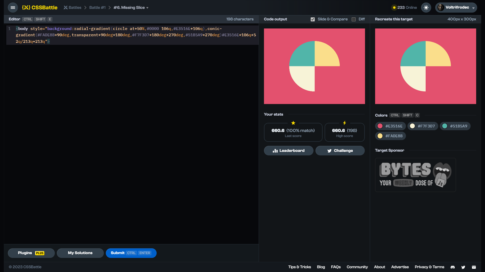

# Target #6: Missing Slice

[Link to the target](https://cssbattle.dev/play/6)



<br>

```html
<body style="background:radial-gradient(circle at+50%,#0000 106q,#E3516E+106q),conic-gradient(#FADE8B+90deg,transparent+90deg+180deg,#F7F3D7+180deg+270deg,#51B5A9+270deg)#E3516E+106q+52q/213q+213q">
```


## Attempts
| Attempt | Score | Link |
|:-:|:-:|:-:|
| 1 | 623.81 {296}, 100% match | [Link to the solution](/001-pilot-battle/src/html/006_missing-slice_attempt-01.html) |
| 2 | 636.92 {250}, 100% match | [Link to the solution](/001-pilot-battle/src/html/006_missing-slice_attempt-02.html) |
| 3 | 660.60 {198}, 100% match | [Link to the solution](/001-pilot-battle/src/html/006_missing-slice_attempt-03.html) |
