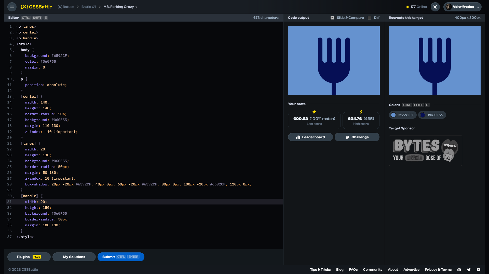

# Target #8: Forking Crazy

[Link to the target](https://cssbattle.dev/play/8)



<br>

```html
<p tines>
<p center>
<p handle>
<style>
  body {
    background: #6592CF;
    color: #060F55;
    margin: 0;
  }
  p {
    position: absolute;
  }
  [center] {
    width: 140;
    height: 140;
    border-radius: 50%;
    background: #060F55;
    margin: 110 130;
    z-index: -10 !important;
  }
  [tines] {
    width: 20;
    height: 130;
    background: #060F55;
    border-radius: 50px;
    margin: 50 130;
    z-index: 10 !important;
    box-shadow: 20px -20px #6592CF, 40px 0px, 60px -20px #6592CF, 80px 0px, 100px -20px #6592CF, 120px 0px;
  }
  [handle] {
    width: 20;
    height: 150;
    background: #060F55;
    border-radius: 50px;
    margin: 180 190;
  }
</style>
```


## Attempts
| Attempt | Score | Link |
|:-:|:-:|:-:|
| 1 | 600.62 {678}, 100% match | [Link to the solution](/001-pilot-battle/src/html/008_forking-crazy_attempt-01.html) |
| 2 | 603.89 {486}, 100% match | [Link to the solution](/001-pilot-battle/src/html/008_forking-crazy_attempt-02.html) |
| 3 | 617.55 {328}, 100% match | [Link to the solution](/001-pilot-battle/src/html/008_forking-crazy_attempt-03.html) |