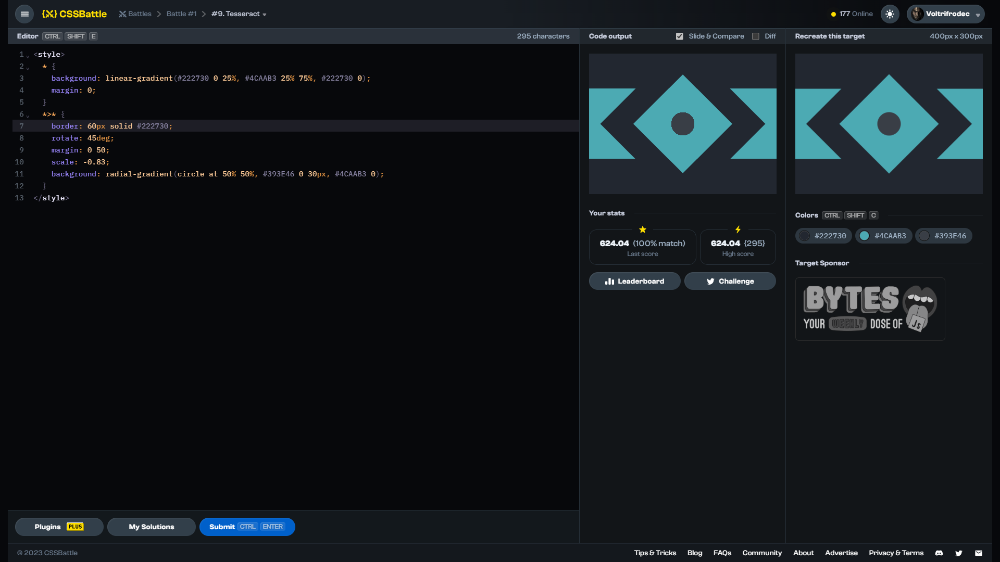

# Target #9: Tesseract

[Link to the target](https://cssbattle.dev/play/9)



<br>

```html
<style>
  * {
    background: linear-gradient(#222730 0 25%, #4CAAB3 25% 75%, #222730 0);
    margin: 0;
  }
  *>* {
    border: 60px solid #222730;
    rotate: 45deg;
    margin: 0 50;
    scale: -0.83;
    background: radial-gradient(circle at 50% 50%, #393E46 0 30px, #4CAAB3 0);
  }
</style>
```


## Attempts
| Attempt | Score | Link |
|:-:|:-:|:-:|
| 1 | 624.24 {295}, 100% match | [Link to the solution](/001-pilot-battle/src/html/009_tesseract_attempt-01.html) |
| 2 | 658.89 {201}, 100% match | [Link to the solution](/001-pilot-battle/src/html/009_tesseract_attempt-02.html) |