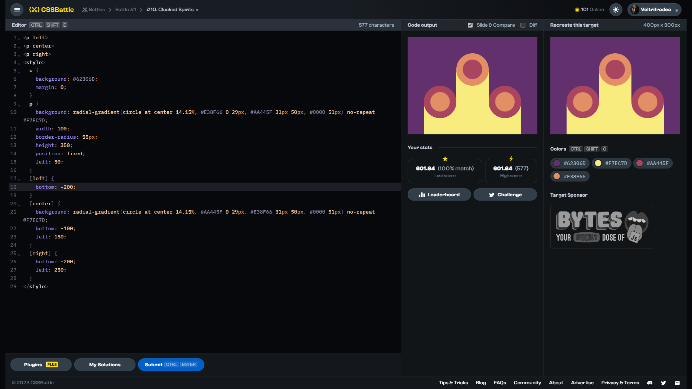

# Target #10: Cloaked Spirits

[Link to the target](https://cssbattle.dev/play/10)



<br>

```html
<p left>
<p center>
<p right>
<style>
  * {
    background: #62306D;
    margin: 0;
  }
  p {
    background: radial-gradient(circle at center 14.15%, #E38F66 0 29px, #AA445F 31px 50px, #0000 51px) no-repeat #F7EC7D;
    width: 100;
    border-radius: 55px;
    height: 350;
    position: fixed;
    left: 50;
  }
  [left] {
    bottom: -200;
  }
  [center] {
    background: radial-gradient(circle at center 14.15%, #AA445F 0 29px, #E38F66 31px 50px, #0000 51px) no-repeat #F7EC7D;
    bottom: -100;
    left: 150;
  }
  [right] {
    bottom: -200;
    left: 250;
  }
</style>
```


## Attempts
| Attempt | Score | Link |
|:-:|:-:|:-:|
| 1 | 601.64 {577}, 100% match | [Link to the solution](/001-pilot-battle/src/html/010_cloaked-spirits_attempt-01.html) |
| 2 | 614.23 {350}, 100% match | [Link to the solution](/001-pilot-battle/src/html/010_cloaked-spirits_attempt-02.html) |