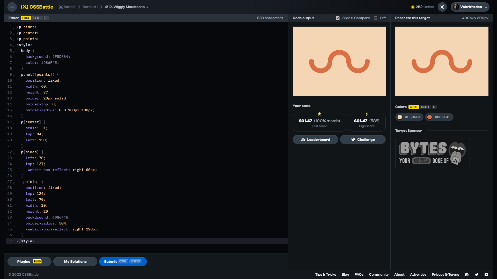

# Target #12: Wiggly Moustache

[Link to the target](https://cssbattle.dev/play/12)



<br>

```html
<p sides>
<p center>
<p points>
<style>
  body {
    background: #F5D6B4;
    color: #D86F45;
  }
  p:not([points]) {
    position: fixed;
    width: 60;
    height: 37;
    border: 20px solid;
    border-top: 0;
    border-radius: 0 0 100px 100px;
  }
  p[center] {
    scale: -1;
    top: 84;
    left: 150;
  }
  p[sides] {
    left: 70;
    top: 127;
    -webkit-box-reflect: right 60px;
  }
  [points] {
    position: fixed;
    top: 124;
    left: 70;
    width: 20;
    height: 20;
    background: #D86F45;
    border-radius: 50%;
    -webkit-box-reflect: right 220px;
  }
</style>
```


## Attempts
| Attempt | Score | Link |
|:-:|:-:|:-:|
| 1 | 600.57 {687}, 100% match | [Link to the solution](/001-pilot-battle/src/html/012_wiggly-moustache_attempt-01.html) |
| 2 | 601.47 {588}, 100% match | [Link to the solution](/001-pilot-battle/src/html/012_wiggly-moustache_attempt-02.html) |
| 3 | 604.41 {473}, 100% match | [Link to the solution](/001-pilot-battle/src/html/012_wiggly-moustache_attempt-03.html) |
| 4 | 619.49 {317}, 100% match | [Link to the solution](/001-pilot-battle/src/html/012_wiggly-moustache_attempt-04.html) |
