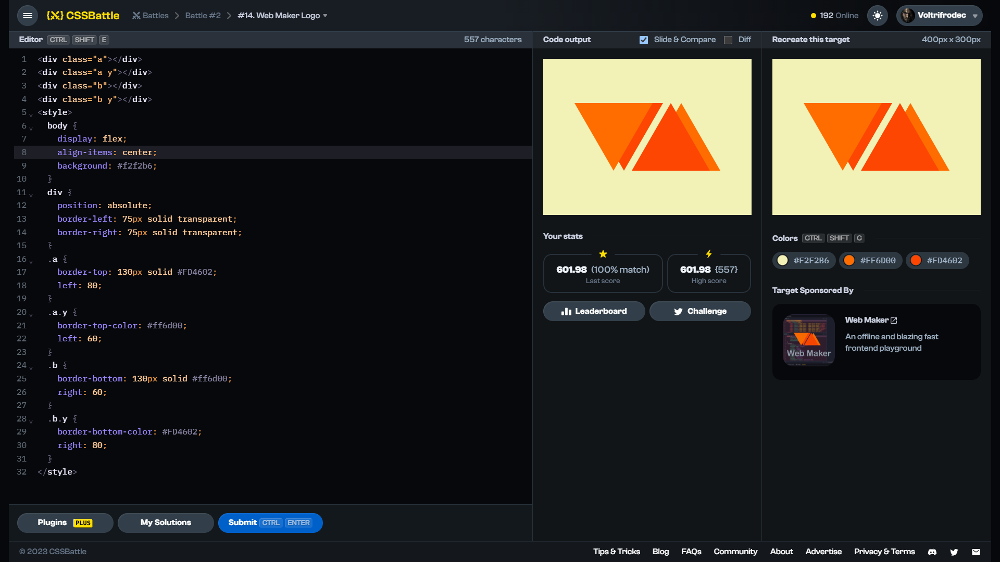

# Target #14: Web Maker Logo

[Link to the target](https://cssbattle.dev/play/14)



<br>

```html
<p><p><p><p>
<style>
  * {
    background: #F2F2B6;
    color: #FF6D00;
  }
  p {
    background: 0;
    margin: 77 72;
    border-left: 75px solid #0000;
    border-right: 75px solid #0000;
    border-top: 130px solid #FD4602;
    position: fixed;
  }
  p+p {
    margin: 77 52;
    border-top-color: #FF6D00;
  }
  p+p+p {
    scale: -1;
    margin: 77 182; 
  }
  p+p+p+p {
    margin: 77 162;
    border-top-color: #FD4602;
  }
</style>
```


## Attempts
| Attempt | Score | Link |
|:-:|:-:|:-:|
| 1 | 600.53 {695}, 100% match | [Link to the solution](src/html/014_web-maker-logo_attempt-01.html) |
| 2 | 601.98 {557}, 100% match | [Link to the solution](src/html/014_web-maker-logo_attempt-02.html) |
| 3 | 606.04 {440}, 100% match | [Link to the solution](src/html/014_web-maker-logo_attempt-03.html) |
| 4 | 607.52 {417}, 100% match | [Link to the solution](src/html/014_web-maker-logo_attempt-04.html) |
| 5 | 629.65 {273}, 100% match | [Link to the solution](src/html/014_web-maker-logo_attempt-05.html) |