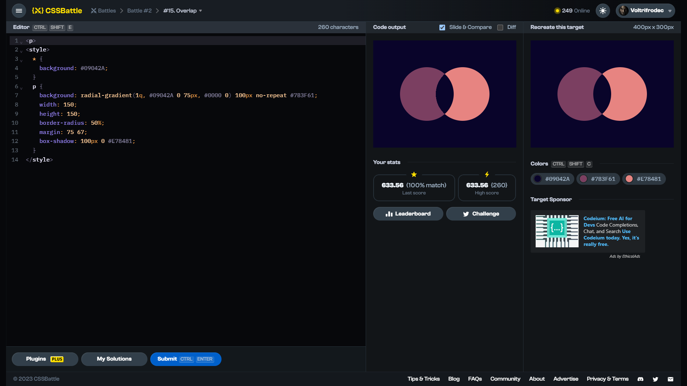

# Target #15: Overlap

[Link to the target](https://cssbattle.dev/play/15)



<br>

```html
<p>
<style>
  * {
    background: #09042A;
  }
  p {
    background: radial-gradient(1q, #09042A 0 75px, #0000 0) 100px no-repeat #7B3F61;
    width: 150;
    height: 150;
    border-radius: 50%;
    margin: 75 67;
    box-shadow: 100px 0 #E78481;
  }
</style>
```


## Attempts
| Attempt | Score | Link |
|:-:|:-:|:-:|
| 1 | 633.56 {260}, 100% match | [Link to the solution](src/html/015_overlap_attempt-01.html) |
| 2 | 646.85 {225}, 100% match | [Link to the solution](src/html/015_overlap_attempt-02.html) |
| 3 | 689.58 {157}, 100% match | [Link to the solution](src/html/015_overlap_attempt-03.html) |

Highest place in the leaderboard: ---