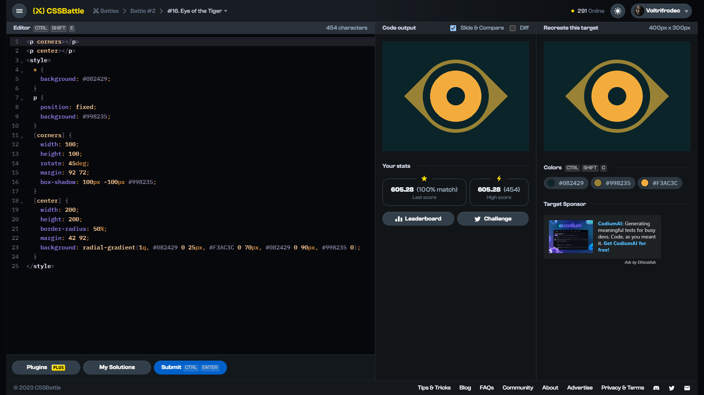

# Target #16: Eye of the Tiger

[Link to the target](https://cssbattle.dev/play/16)



<br>

```html
<p corners></p>
<p center></p>
<style>
  * {
    background: #0B2429;
  }
  p {
    position: fixed;
    background: #998235;
  }
  [corners] {
    width: 100;
    height: 100;
    rotate: 45deg;
    margin: 92 72;
    box-shadow: 100px -100px #998235;
  }
  [center] {
    width: 200;
    height: 200;
    border-radius: 50%;
    margin: 42 92;
    background: radial-gradient(1q, #0B2429 0 25px, #F3AC3C 0 70px, #0B2429 0 90px, #998235 0);
  }
</style>
```


## Attempts
| Attempt | Score | Link |
|:-:|:-:|:-:|
| 1 | 605.28 {454}, 100% match | [Link to the solution](src/html/016_eye-of-the-tiger_attempt-01.html) |
|

Highest place in the leaderboard: ---