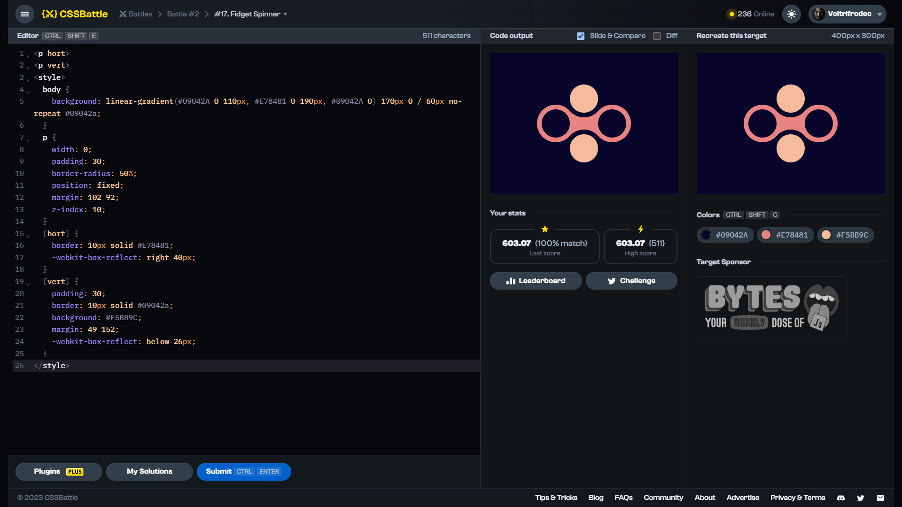

# Target #17: Fidget Spinner

[Link to the target](https://cssbattle.dev/play/17)



<br>

```html
<p hort>
<p vert>
<style>
  body {
    background: linear-gradient(#09042A 0 110px, #E78481 0 190px, #09042A 0) 170px 0 / 60px no-repeat #09042a;
  }
  p {
    width: 0;
    padding: 30;
    border-radius: 50%;
    position: fixed;
    margin: 102 92;
    z-index: 10;
  }
  [hort] {
    border: 10px solid #E78481;
    -webkit-box-reflect: right 40px;
  }
  [vert] {
    padding: 30;
    border: 10px solid #09042a;
    background: #F5BB9C;
    margin: 49 152;
    -webkit-box-reflect: below 26px;
  }
</style>
```


## Attempts
| Attempt | Score | Link |
|:-:|:-:|:-:|
| 1 | 603.07 {511}, 100% match | [Link to the solution](src/html/017_fidget-spinner_attempt-01.html) |
| 2 | 605.76 {557}, 100% match | [Link to the solution](src/html/017_fidget-spinner_attempt-02.html) |
| 3 | 618.59 {322}, 100% match | [Link to the solution](src/html/017_fidget-spinner_attempt-03.html) |

<!-- Highest place in the leaderboard: 37 (2023-09-04) -->