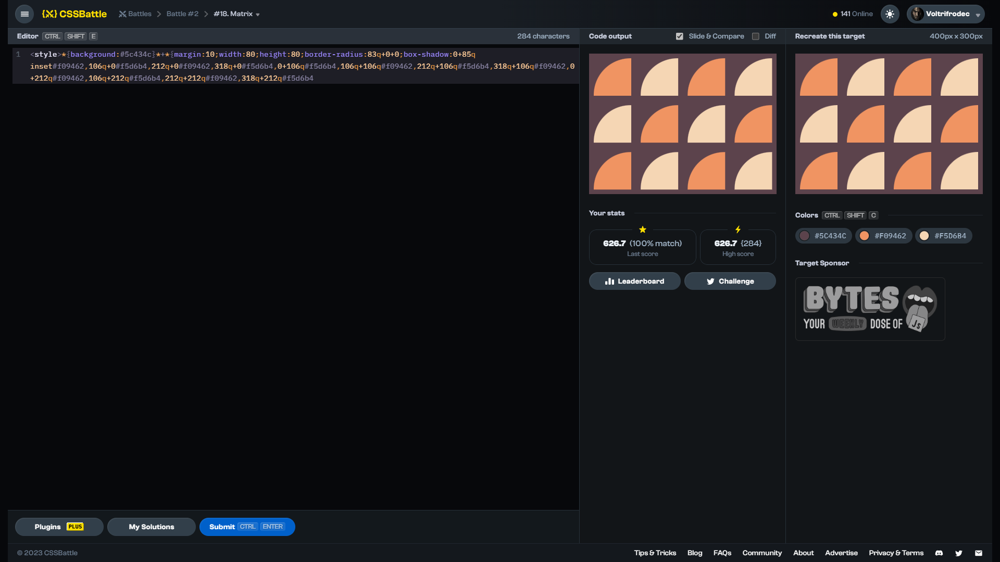

# Target #18: Matrix

[Link to the target](https://cssbattle.dev/play/18)



<br>

```html
<div></div>
<style>
  body {
    background: #5C434C;
  }
  div {
    margin: 10px 2px;
    width: 80px;
    height: 80px;
    border-radius: 80px 0 0 0;
    box-shadow: 0 5in inset #F09462, 100px 0px #F5D6B4, 200px 0 #F09462,
                300px 0 #F5D6B4, 0px 100px #F5D6B4, 100px 100px #F09462, 200px 100px #F5D6B4, 300px 100px #F09462, 0 200px #F09462, 100px 200px #F5D6B4, 200px 200px #F09462, 300px 200px #F5D6B4;
  }
</style>
```


## Attempts
| Attempt | Score | Link |
|:-:|:-:|:-:|
| 1 | 606.39 {434}, 100% match | [Link to the solution](src/html/018_matrix_attempt-01.html) |
| 2 | 609.09 {385}, 100% match | [Link to the solution](src/html/018_matrix_attempt-02.html) |