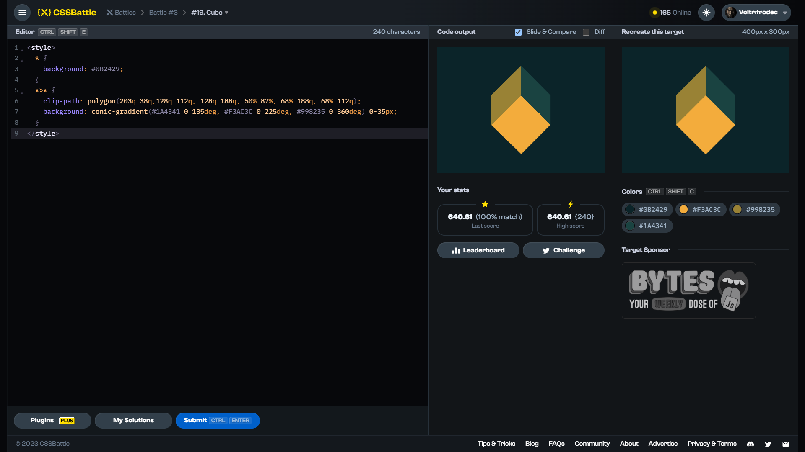

# Target #19: Cube

[Link to the target](https://cssbattle.dev/play/19)



<br>

```html
<style>
  * {
    background: #0B2429;
  }
  *>* {
    clip-path: polygon(203q 38q,128q 112q, 128q 188q, 50% 87%, 68% 188q, 68% 112q);
    background: conic-gradient(#1A4341 0 135deg, #F3AC3C 0 225deg, #998235 0 360deg) 0-35px;
  }
</style>
```


## Attempts
| Attempt | Score | Link |
|:-:|:-:|:-:|
| 1 | 601.56 {582}, 100% match | [Link to the solution](src/html/019_cube_attempt-01.html) |
| 2 | 610.39 {383}, 100% match | [Link to the solution](src/html/019_cube_attempt-02.html) |
| 3 | 640.61 {240}, 100% match | [Link to the solution](src/html/019_cube_attempt-03.html) |
| 4 | 667.94 {186}, 100% match | [Link to the solution](src/html/019_cube_attempt-04.html) |
| 5 | 684.60 {163}, 100% match | [Link to the solution](src/html/019_cube_attempt-05.html) |

Highest place in the leaderboard: 46 (2023-09-30)