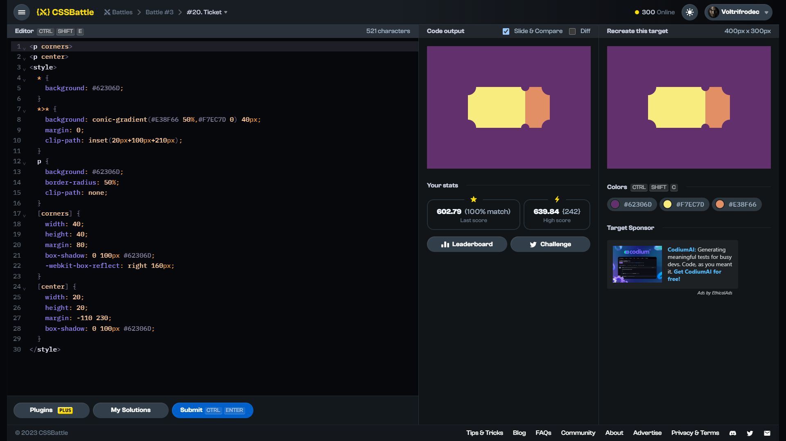

# Target #20: Ticket

[Link to the target](https://cssbattle.dev/play/20)



<br>

```html
<p corners>
<p center>
<style>
  * {
    background: #62306D;
  }
  *>* {
    background: conic-gradient(#E38F66 50%,#F7EC7D 0) 40px;
    margin: 0;
    clip-path: inset(20px+100px+210px);
  }
  p {
    background: #62306D;
    border-radius: 50%;
    clip-path: none;
  }
  [corners] {
    width: 40;
    height: 40;
    margin: 80;
    box-shadow: 0 100px #62306D;
    -webkit-box-reflect: right 160px;
  }
  [center] {
    width: 20;
    height: 20;
    margin: -110 230;
    box-shadow: 0 100px #62306D; 
  }
</style>
```


## Attempts
| Attempt | Score | Link |
|:-:|:-:|:-:|
| 1 | 609.01 {398}, 100% match | [Link to the solution](src/html/020_ticket_attempt-01.html) |
| 2 | 630.22 {271}, 100% match | [Link to the solution](src/html/020_ticket_attempt-02.html) |
| 3 | 602.79 {521}, 100% match | [Link to the solution](src/html/020_ticket_attempt-03.html) |
| 4 | 618.06 {325}, 100% match | [Link to the solution](src/html/020_ticket_attempt-04.html) |
| 5 | 639.84 {242}, 100% match | [Link to the solution](src/html/020_ticket_attempt-05.html) |

Highest place in the leaderboard: ---