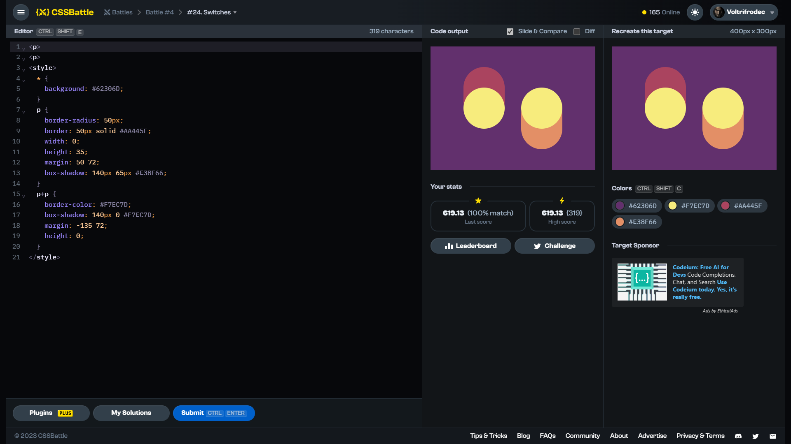

# Target #24: Switches

[Link to the target](https://cssbattle.dev/play/24)



<br>

```html
<p>
<p>
<style>
  * {
    background: #62306D;
  }
  p {
    border-radius: 50px;
    border: 50px solid #AA445F;
    width: 0;
    height: 35;
    margin: 50 72;
    box-shadow: 140px 65px #E38F66;
  }
  p+p {
    border-color: #F7EC7D;
    box-shadow: 140px 0 #F7EC7D;
    margin: -135 72;
    height: 0;
  }
</style>
```


## Attempts
| Attempt | Score | Link |
|:-:|:-:|:-:|
| 1 | 619.13 {319}, 100% match | [Link to the solution](src/html/024_switches_attempt-01.html) |
| 2 | 620.64 {311}, 100% match | [Link to the solution](src/html/024_switches_attempt-02.html) |
| 3 | 660.03 {199}, 100% match | [Link to the solution](src/html/024_switches_attempt-03.html) |

Highest place in the leaderboard: 78 (2023-10-21)