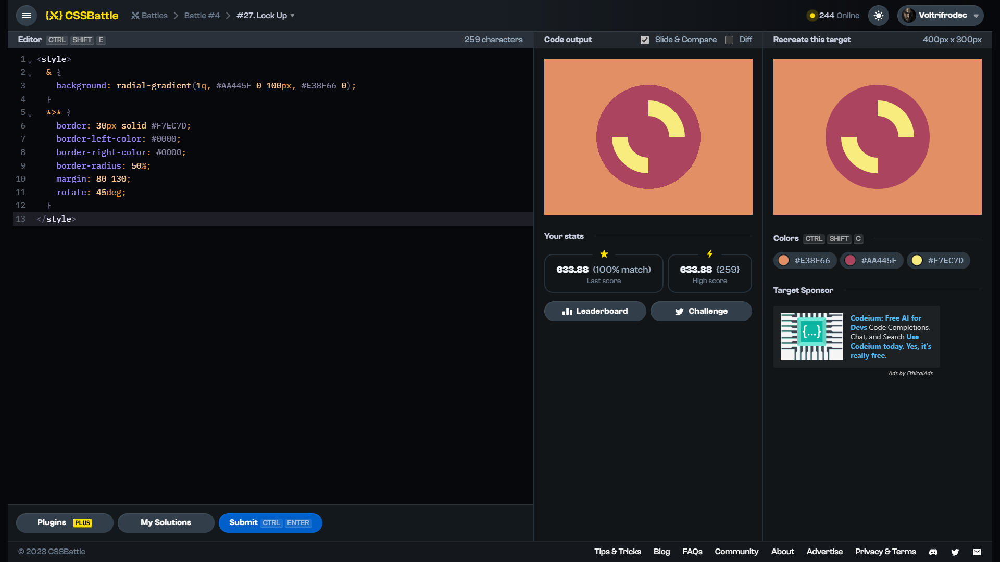

# Target #27: Lock Up

[Link to the target](https://cssbattle.dev/play/27)



<br>

```html
<style>
  & {
    background: radial-gradient(1q, #AA445F 0 100px, #E38F66 0);
  }
  *>* {
    border: 30px solid #F7EC7D;
    border-left-color: #0000;
    border-right-color: #0000;
    border-radius: 50%;
    margin: 80 130;
    rotate: 45deg;
  }
</style>
```


## Attempts
| Attempt | Score | Link |
|:-:|:-:|:-:|
| 1 | 633.88 {259}, 100% match | [Link to the solution](src/html/027_lock-up_attempt-01.html) |
| 2 | 649.61 {219}, 100% match | [Link to the solution](src/html/027_lock-up_attempt-02.html) |
| 3 | 693.06 {153}, 100% match | [Link to the solution](src/html/027_lock-up_attempt-03.html) |

Highest place in the leaderboard: 78 (2023-10-21)