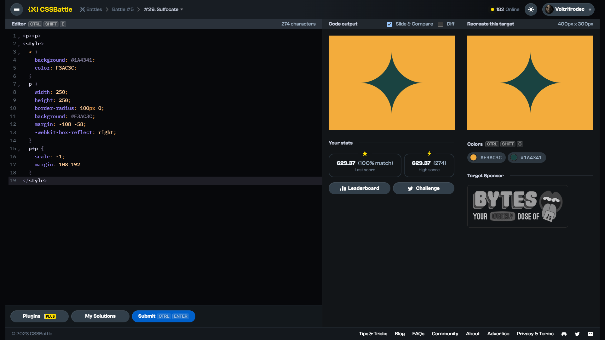

# Target #29: Suffocate

[Link to the target](https://cssbattle.dev/play/29)



<br>

```html
<p><p>
<style>
  * {
    background: #1A4341;
    color: F3AC3C;
  }
  p {
    width: 250;
    height: 250;
    border-radius: 100px 0;
    background: #F3AC3C;
    margin: -108 -58;
    -webkit-box-reflect: right;
  }
  p+p {
    scale: -1;
    margin: 108 192
  }
</style>
```


## Attempts
| Attempt | Score | Link |
|:-:|:-:|:-:|
| 1 | 629.37 {274}, 100% match | [Link to the solution](src/html/029_suffocate_attempt-01.html) |
| 2 | 635.88 {253}, 100% match | [Link to the solution](src/html/029_suffocate_attempt-02.html) |
| 3 | 684.60 {163}, 100% match | [Link to the solution](src/html/029_suffocate_attempt-03.html) |