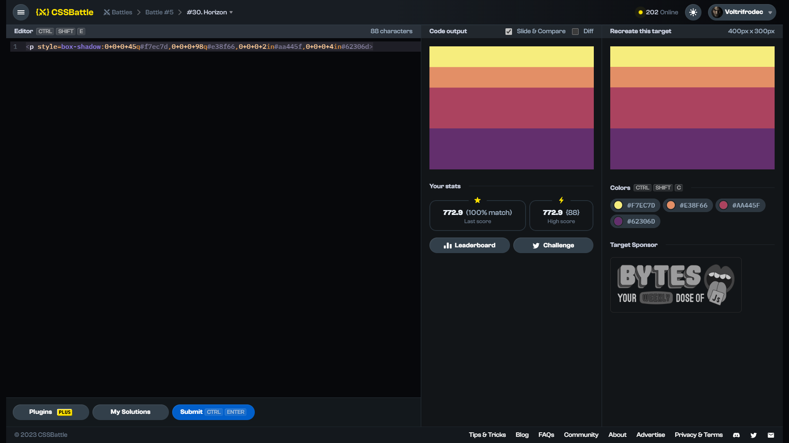

# Target #30: Horizon

[Link to the target](https://cssbattle.dev/play/30)



<br>

```html
<div class="a"></div>
<style>
  body {
    background: linear-gradient(to bottom, #AA445F 66.5%, #62306D 0);
    margin: 0;
  }
  .a {
    width: 400;
    height: 100;
    background: linear-gradient(to bottom, #F7EC7D 50%, #E38F66 0)
  }
</style>
```


## Attempts
| Attempt | Score | Link |
|:-:|:-:|:-:|
| 1 | 637.99 {247}, 100% match | [Link to the solution](src/html/030_horizon_attempt-01.html) |
| 2 | 727.45 {120}, 100% match | [Link to the solution](src/html/030_horizon_attempt-02.html) |
| 3 | 772.90 {088}, 100% match | [Link to the solution](src/html/030_horizon_attempt-03.html) |

Highest place in the leaderboard: 68 (unknown)