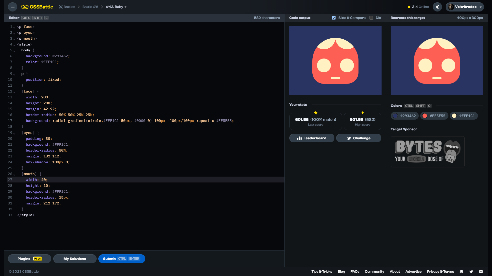

# Target #42: Baby

[Link to the target](https://cssbattle.dev/play/42)



<br>

```html
<p face>
<p eyes>
<p mouth>
<style>
  body {
    background: #293462;
    color: #FFF1C1;
  }
  p {
    position: fixed;
  }
  [face] {
    width: 200;
    height: 200;
    margin: 42 92;
    border-radius: 50% 50% 25% 25%;
    background: radial-gradient(circle,#FFF1C1 50px, #0000 0) 100px -100px/100px repeat-x #FE5F55;
  }
  [eyes] {
    padding: 30;
    background: #FFF1C1;
    border-radius: 50%;
    margin: 132 112;
    box-shadow: 100px 0;
  }
  [mouth] {
    width: 40;
    height: 10;
    background: #FFF1C1;
    border-radius: 15px;
    margin: 212 172;
  }  
</style>
```


## Attempts
| Attempt | Score | Link |
|:-:|:-:|:-:|
| 1 | 601.56 {582}, 100% match | [Link to the solution](src/html/042_baby_attempt-01.html) |
| 2 | 603.82 {488}, 100% match | [Link to the solution](src/html/042_baby_attempt-02.html) |
| 3 | 614.93 {345}, 100% match | [Link to the solution](src/html/042_baby_attempt-03.html) |