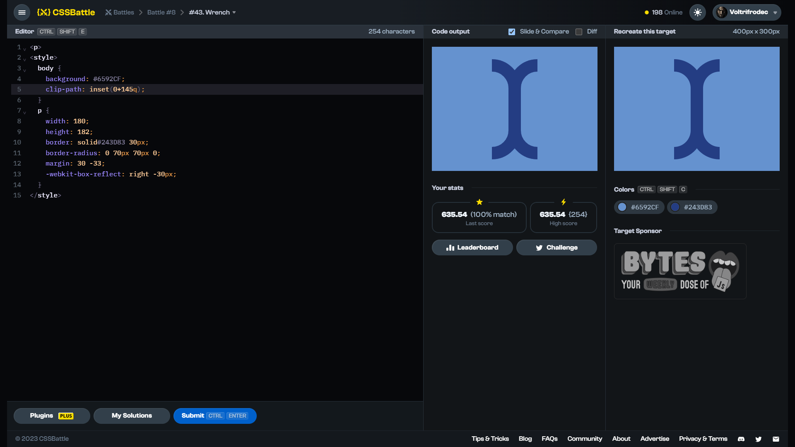

# Target #43: Wrench

[Link to the target](https://cssbattle.dev/play/43)



<br>

```html
<p>
<style>
  body {
    background: #6592CF;
    clip-path: inset(0+145q);
  }
  p {
    width: 180;
    height: 182;
    border: solid#243D83 30px;
    border-radius: 0 70px 70px 0;
    margin: 30 -33;
    -webkit-box-reflect: right -30px;
  }
</style>
```


## Attempts
| Attempt | Score | Link |
|:-:|:-:|:-:|
| 1 | 635.54 {254}, 100% match | [Link to the solution](src/html/043_wrench_attempt-01.html) |
| 3 | 682.21 {166}, 100% match | [Link to the solution](src/html/043_wrench_attempt-02.html) |