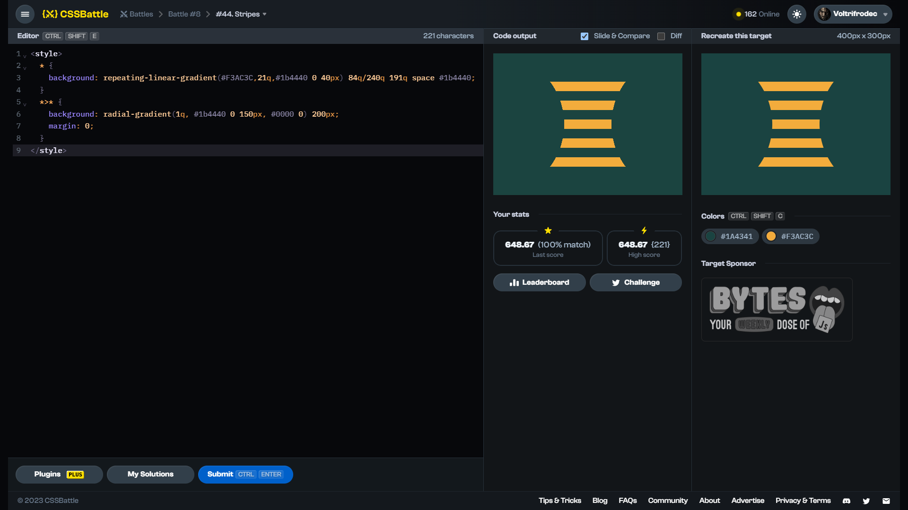

# Target #44: Stripes

[Link to the target](https://cssbattle.dev/play/44)



<br>

```html
<style>
  * {
    background: repeating-linear-gradient(#F3AC3C,21q,#1b4440 0 40px) 84q/240q 191q space #1b4440;
  }
  *>* {
    background: radial-gradient(1q, #1b4440 0 150px, #0000 0) 200px;
    margin: 0;
  }
</style>
```


## Attempts
| Attempt | Score | Link |
|:-:|:-:|:-:|
| 1 | 648.67 {221}, 100% match | [Link to the solution](src/html/044_stripes_attempt-01.html) |
| 2 | 676.91 {173}, 100% match | [Link to the solution](src/html/044_stripes_attempt-02.html) |
| 3 | 703.34 {142}, 100% match | [Link to the solution](src/html/044_stripes_attempt-03.html) |