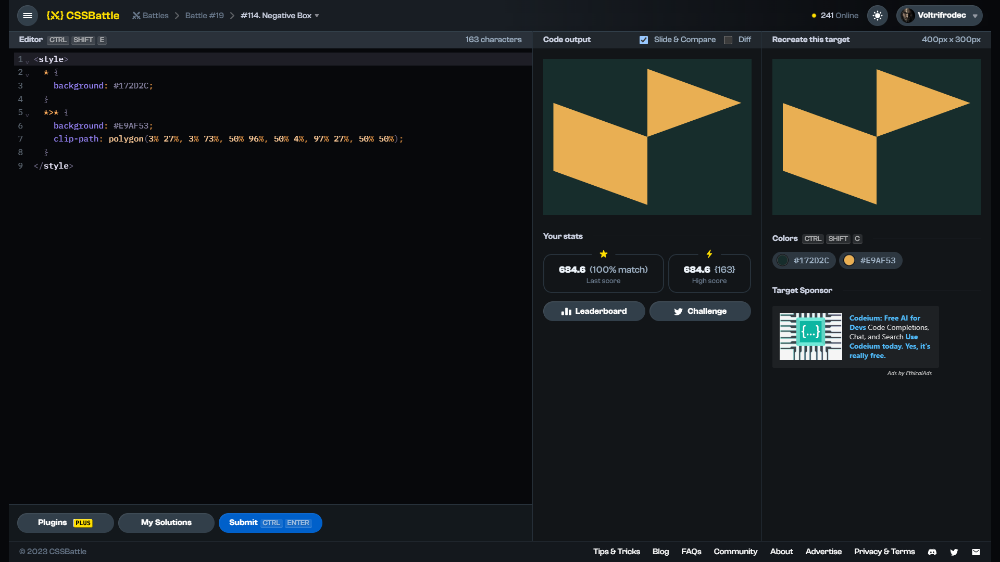

# Target #114: Negative Box

[Link to the target](https://cssbattle.dev/play/114)



<br>

```html
<style>
  * {
    background: #172D2C;
  }
  *>* {
    background: #E9AF53;
    clip-path: polygon(3% 27%, 3% 73%, 50% 96%, 50% 4%, 97% 27%, 50% 50%);
  }
</style>
```


## Attempts
| Attempt | Score | Link |
|:-:|:-:|:-:|
| 1 | 684.60 {160}, 100% match | [Link to the solution](/019-spacing/src/html/114_negative-box_attempt-01.html) |
| 2 | 745.65 {106}, 100% match | [Link to the solution](/019-spacing/src/html/114_negative-box_attempt-02.html) |


Highest place in the leaderboard: 27 (2023-10-26)