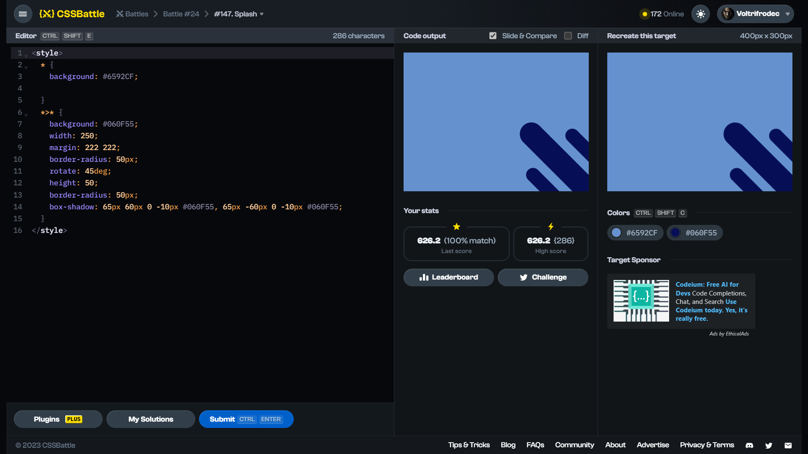

# Target #147: Splash

[Link to the target](https://cssbattle.dev/play/147)



<br>

```html
<style>
  * {
    background: #6592CF;
    
  }
  *>* {
    background: #060F55;
    width: 250;
    margin: 222 222;
    border-radius: 50px;
    rotate: 45deg;
    height: 50;
    border-radius: 50px;
    box-shadow: 65px 60px 0 -10px #060F55, 65px -60px 0 -10px #060F55;
  }
</style>
```


## Attempts
| Attempt | Score | Link |
|:-:|:-:|:-:|
| 1 | 626.20 {286}, 100% match | [Link to the solution](/024-offset/src/html/147_splash_attempt-01.html) |
| 2 | 641.39 {238}, 100% match | [Link to the solution](/024-offset/src/html/147_splash_attempt-02.html) |
| 3 | 683.80 {164}, 100% match | [Link to the solution](/024-offset/src/html/147_splash_attempt-03.html) |


Highest place in the leaderboard: 55 (2023-10-15)