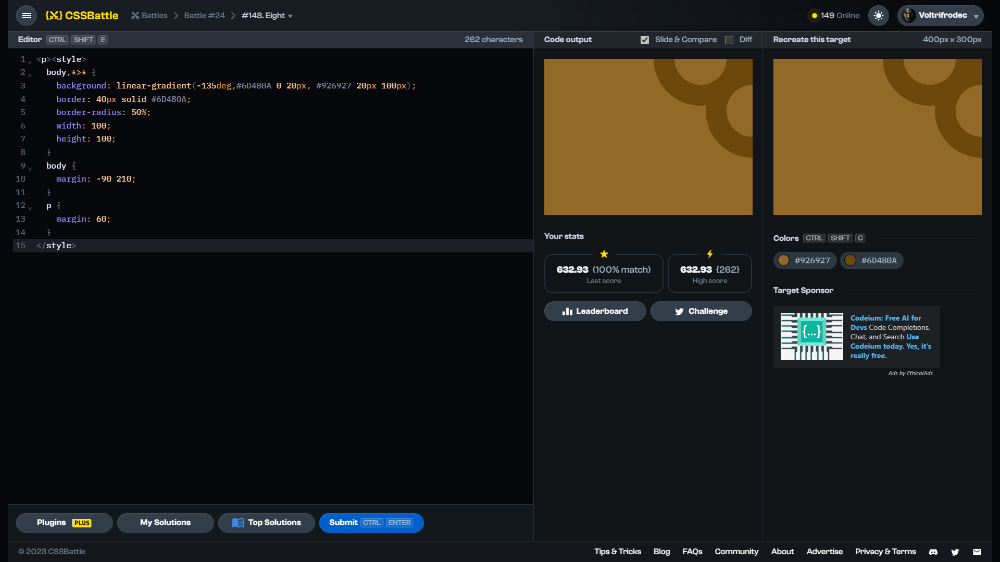

# Target #148: Eight

[Link to the target](https://cssbattle.dev/play/148)



<br>

```html
<p><style>
  body,*>* {
    background: linear-gradient(-135deg,#6D480A 0 20px, #926927 20px 100px);
    border: 40px solid #6D480A;
    border-radius: 50%;
    width: 100;
    height: 100;
  }
  body {
    margin: -90 210;
  }
  p {
    margin: 60;
  }
</style>
```


## Attempts
| Attempt | Score | Link |
|:-:|:-:|:-:|
| 1 | 632.93 {262}, 100% match | [Link to the solution](/024-offset/src/html/148_eight_attempt-01.html) |
| 2 | 646.41 {226}, 100% match | [Link to the solution](/024-offset/src/html/148_eight_attempt-02.html) |
| 3 | 686.23 {161}, 100% match | [Link to the solution](/024-offset/src/html/148_eight_attempt-03.html) |