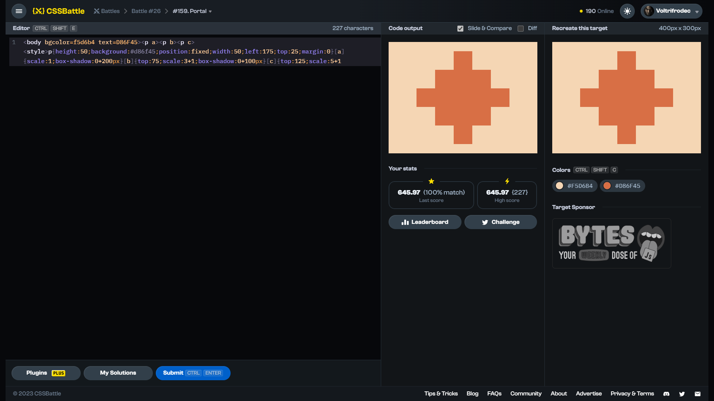

# Target #159: Portal

[Link to the target](https://cssbattle.dev/play/159)



<br>

```html
<p a></p>
<p b></p>
<p c></p>
<style>
  * {
    margin: 0;
  }
  body {
    background: #F5D6B4;
    display: flex;
    justify-content: center;
    margin: 25;
  }
  p {
    height: 50;
    background: #D86F45;
    position: fixed;
  }
  [a] {
    width: 50;
    box-shadow: 0px 200px #D86F45;
  }
  [b] {
    top: 75;
    width: 150;
    box-shadow: 0px 100px #D86F45;
  }
  [c] {
    top: 125;
    width: 250;
  }
</style>
```


## Attempts
| Attempt | Score | Link |
|:-:|:-:|:-:|
| 1 | 606.96 {425}, 100% match | [Link to the solution](/026-initial/src/html/159_portal_attempt-01.html) |
| 2 | 610.80 {379}, 100% match | [Link to the solution](/026-initial/src/html/159_portal_attempt-02.html) |
| 3 | 645.97 {227}, 100% match | [Link to the solution](/026-initial/src/html/159_portal_attempt-03.html) |


Highest place in the leaderboard: 98 (2023-08-25)