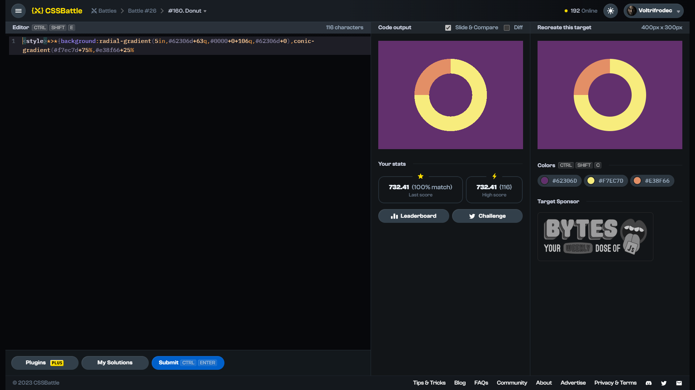

# Target #160: Donut

[Link to the target](https://cssbattle.dev/play/160)



<br>

```html
<style>
  *>* {
    background: radial-gradient(100px, #62306D 60px, #0000 0), conic-gradient(#F7EC7D 270deg, #E38F66 270deg);
    border-radius: 50%;
    outline: 250px solid #62306D;
    margin: 50 25%;
  }
</style>
```


## Attempts
| Attempt | Score | Link |
|:-:|:-:|:-:|
| 1 | 677.64 {172}, 100% match | [Link to the solution](/026-initial/src/html/160_donut_attempt-01.html) |
| 1 | 660.60 {198}, 100% match | [Link to the solution](/026-initial/src/html/160_donut_attempt-02.html) |
| 3 | 687.05 {160}, 100% match | [Link to the solution](/026-initial/src/html/160_donut_attempt-03.html) |
| 4 | 725.05 {122}, 100% match | [Link to the solution](/026-initial/src/html/160_donut_attempt-04.html) |
| 5 | 732.41 {116}, 100% match | [Link to the solution](/026-initial/src/html/160_donut_attempt-05.html) |


Highest place in the leaderboard: 33 (2023-08-25)