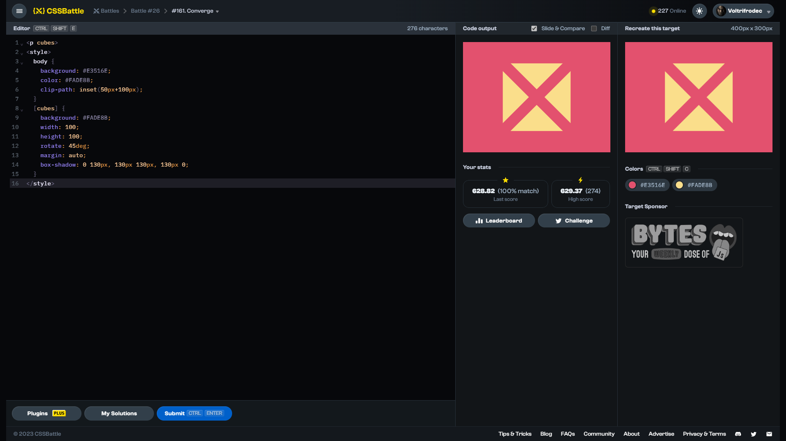

# Target #161: Converge

[Link to the target](https://cssbattle.dev/play/161)



<br>

```html
<p cubes>
<style>
  body {
    background: #E3516E;
    color: #FADE8B;
    clip-path: inset(50px+100px);
  }
  [cubes] {
    background: #FADE8B;
    width: 100;
    height: 100;
    rotate: 45deg;
    margin: auto;
    box-shadow: 0 130px, 130px 130px, 130px 0;
  }
</style>
```


## Attempts
| Attempt | Score | Link |
|:-:|:-:|:-:|
| 1 | 628.82 {276}, 100% match | [Link to the solution](/026-initial/src/html/161_converge_attempt-01.html) |
| 2 | 634.54 {257}, 100% match | [Link to the solution](/026-initial/src/html/161_converge_attempt-02.html) |
| 3 | 676.91 {173}, 100% match | [Link to the solution](/026-initial/src/html/161_converge_attempt-03.html) |

Highest place in the leaderboard: 676.91 (2023-09-01)