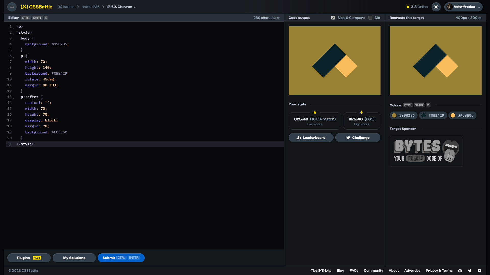

# Target #162: Chevron

[Link to the target](https://cssbattle.dev/play/162)



<br>

```html
<p>
<style>
  body {
    background: #998235;
  }
  p {
    width: 70;
    height: 140;
    background: #0B2429;
    rotate: 45deg;
    margin: 80 133;
  }
  p::after {
    content: '';
    width: 70;
    height: 70;
    display: block;
    margin: 70;
    background: #FCBE5C
  }
</style>
```


## Attempts
| Attempt | Score | Link |
|:-:|:-:|:-:|
| 1 | 625.46 {289}, 100% match | [Link to the solution](/026-initial/src/html/162_chevron_attempt-01.html) |
| 2 | 669.92 {183}, 100% match | [Link to the solution](/026-initial/src/html/162_chevron_attempt-02.html) |
| 3 | 640.23 {241}, 100% match | [Link to the solution](/026-initial/src/html/162_chevron_attempt-03.html) |
| 4 | 703.34 {142}, 100% match | [Link to the solution](/026-initial/src/html/162_chevron_attempt-04.html) |


Highest place in the leaderboard: 31 (2023-09-01)