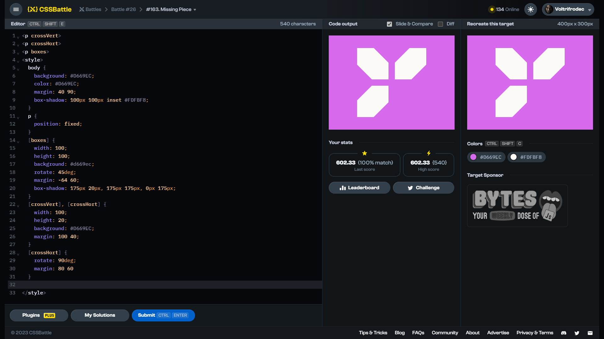

# Target #163: Missing Piece

[Link to the target](https://cssbattle.dev/play/163)



<br>

```html
<p crossVert>
<p crossHort>
<p boxes>
<style>
  body {
    background: #D669EC;
    color: #D669EC;
    margin: 40 90;
    box-shadow: 100px 100px inset #FDFBF8;
  }
  p {
    position: fixed;
  }
  [boxes] {
    width: 100;
    height: 100;
    background: #d669ec;
    rotate: 45deg;
    margin: -64 60;
    box-shadow: 175px 20px, 175px 175px, 0px 175px;
  }
  [crossVert], [crossHort] {
    width: 100;
    height: 20;
    background: #D669EC;
    margin: 100 40;
  }
  [crossHort] {
    rotate: 90deg;
    margin: 80 60
  }
  
</style>
```


## Attempts
| Attempt | Score | Link |
|:-:|:-:|:-:|
| 1 | 602.33 {540}, 100% match | [Link to the solution](/026-initial/src/html/163_missing-piece_attempt-01.html) |
| 2 | 606.51 {432}, 100% match | [Link to the solution](/026-initial/src/html/163_missing-piece_attempt-02.html) |
| 3 | 625.22 {290}, 100% match | [Link to the solution](/026-initial/src/html/163_missing-piece_attempt-03.html) |


Highest place in the leaderboard: 75 (2023-09-10)