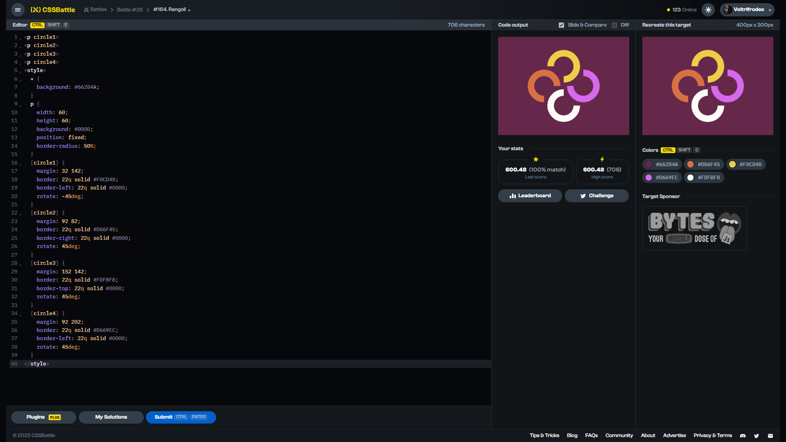

# Target #164: Rangoli

[Link to the target](https://cssbattle.dev/play/164)



<br>

```html
<p circle1>
<p circle2>
<p circle3>
<p circle4>
<style>
  * {
    background: #66284A; 
  }
  p {
    width: 60;
    height: 60;
    background: #0000;
    position: fixed;
    border-radius: 50%;
  }
  [circle1] {
    margin: 32 142;
    border: 22q solid #F0CD48;  
    border-left: 22q solid #0000;
    rotate: -45deg;
  }
  [circle2] {
    margin: 92 82;
    border: 22q solid #D86F45;  
    border-right: 22q solid #0000;
    rotate: 45deg;
  }
  [circle3] {
    margin: 152 142;
    border: 22q solid #FDFBF8;  
    border-top: 22q solid #0000;
    rotate: 45deg;
  }
  [circle4] {
    margin: 92 202;
    border: 22q solid #D669EC;  
    border-left: 22q solid #0000;
    rotate: 45deg;
  }
</style>
```


## Attempts
| Attempt | Score | Link |
|:-:|:-:|:-:|
| 1 | 600.48 {706}, 100% match | [Link to the solution](/026-initial/src/html/164_rangoli_attempt-01.html) |
| 2 | 602.68 {525}, 100% match | [Link to the solution](/026-initial/src/html/164_rangoli_attempt-02.html) |
| 3 | 613.96 {352}, 100% match | [Link to the solution](/026-initial/src/html/164_rangoli_attempt-03.html) |


Highest place in the leaderboard: 39 (2023-09-10)