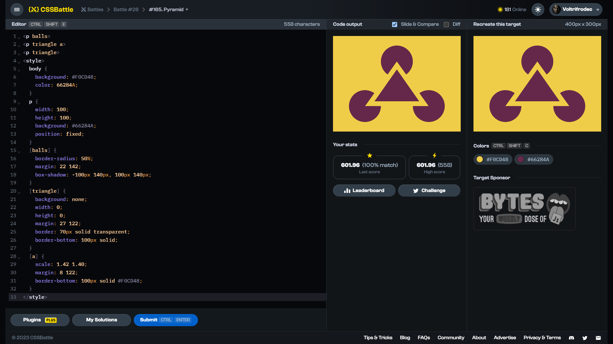

# Target #165: Pyramid

[Link to the target](https://cssbattle.dev/play/165)



<br>

```html
<p balls>
<p triangle a>
<p triangle>
<style>
  body {
    background: #F0CD48;
    color: 66284A;
  }
  p {
    width: 100;
    height: 100;
    background: #66284A;
    position: fixed;
  }
  [balls] {
    border-radius: 50%;
    margin: 22 142;
    box-shadow: -100px 140px, 100px 140px;
  }
  [triangle] {
    background: none;
    width: 0;
    height: 0;
    margin: 27 122;
    border: 70px solid transparent;
    border-bottom: 100px solid;    
  }
  [a] {
    scale: 1.42 1.40;
    margin: 8 122;
    border-bottom: 100px solid #F0CD48;
  }
</style>
```


## Attempts
| Attempt | Score | Link |
|:-:|:-:|:-:|
| 1 | 601.96 {558}, 100% match | [Link to the solution](/026-initial/src/html/165_pyramid_attempt-01.html) |
| 2 | 604.16 {479}, 100% match | [Link to the solution](/026-initial/src/html/165_pyramid_attempt-02.html) |
| 3 | 618.94 {320}, 100% match | [Link to the solution](/026-initial/src/html/165_pyramid_attempt-03.html) |


Highest place in the leaderboard: 21 (2023-09-15)