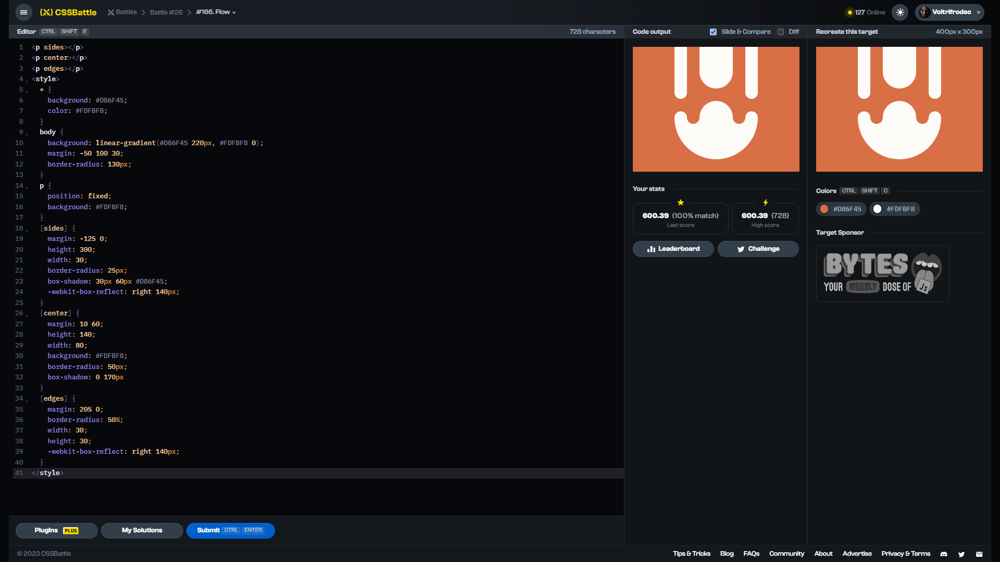

# Target #166: Flow

[Link to the target](https://cssbattle.dev/play/166)



<br>

```html
<p sides></p>
<p center></p>
<p edges></p>
<style>
  * {
    background: #D86F45;
    color: #FDFBF8;
  }
  body {
    background: linear-gradient(#D86F45 220px, #FDFBF8 0);
    margin: -50 100 30;
    border-radius: 130px;
  }
  p {
    position: fixed;
    background: #FDFBF8;
  }
  [sides] {
    margin: -125 0;
    height: 300;
    width: 30;
    border-radius: 25px;
    box-shadow: 30px 60px #D86F45;
    -webkit-box-reflect: right 140px;
  }
  [center] {
    margin: 10 60;
    height: 140;
    width: 80;
    background: #FDFBF8;
    border-radius: 50px;
    box-shadow: 0 170px
  }
  [edges] {
    margin: 205 0;
    border-radius: 50%;
    width: 30;
    height: 30;
    -webkit-box-reflect: right 140px;
  }
</style>
```


## Attempts
| Attempt | Score | Link |
|:-:|:-:|:-:|
| 1 | 600.39 {728}, 100% match | [Link to the solution](/026-initial/src/html/166_flow_attempt-01.html) |
| 2 | 601.82 {566}, 100% match | [Link to the solution](/026-initial/src/html/166_flow_attempt-02.html) |
| 3 | 009.72 {390}, 100% match | [Link to the solution](/026-initial/src/html/166_flow_attempt-03.html) |


Highest place in the leaderboard: 33 (2023-09-16)