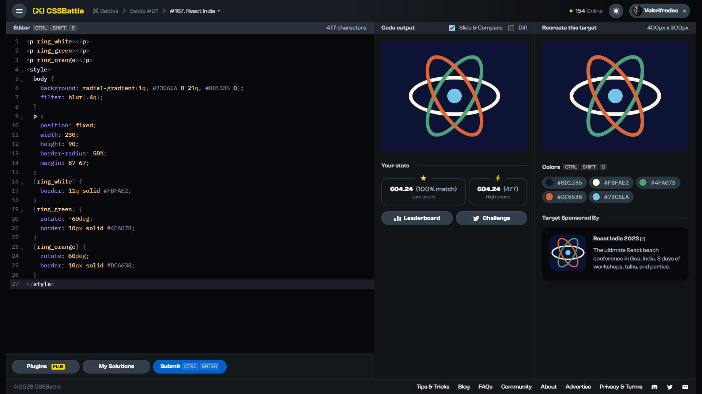

# Target #167: React India

[Link to the target](https://cssbattle.dev/play/167)



<br>

```html
<p ring_white></p>
<p ring_green></p>
<p ring_orange></p>
<style>
  body {
    background: radial-gradient(1q, #73C6EA 0 21q, #0D1335 0);
    filter: blur(.4q);
  }
  p {
    position: fixed;
    width: 230;
    height: 90;
    border-radius: 50%;
    margin: 87 67;
  }
  [ring_white] {
    border: 11q solid #FBFAE2;
  }
  [ring_green] {
    rotate: -60deg;
    border: 10px solid #4FA07B;
  }
  [ring_orange] {
    rotate: 60deg;
    border: 10px solid #DC6638;
  }
</style>
```

## Attempts
| Attempt | Score | Link |
|:-:|:-:|:-:|
| 1 | 604.64 {477}, 100.0% match | [Link to the solution](src/html/167_react-india_attempt_01.html) |
| 2 | 613.57 {355}, 100.0% match | [Link to the solution](src/html/167_react-india_attempt-02.html) |
| 3 | 638.35 {246}, 100.0% match | [Link to the solution](src/html/167_react-india_attempt-03.html) |


Highest place in the leaderboard: 17 (2023-09-25)