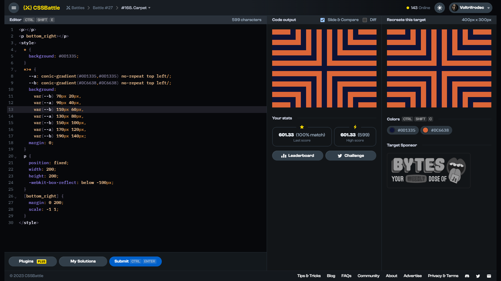

# Target #168: Carpet

[Link to the target](https://cssbattle.dev/play/168)



<br>

```html
<p></p>
<p bottom_right></p>
<style>
  * {
    background: #0D1335;
  }
  *>* {
    --a: conic-gradient(#0D1335,#0D1335) no-repeat top left/;
    --b: conic-gradient(#DC6638,#DC6638) no-repeat top left/;
    background:
      var(--b) 70px 20px,
      var(--a) 90px 40px,
      var(--b) 110px 60px,
      var(--a) 130px 80px,
      var(--b) 150px 100px,
      var(--a) 170px 120px,
      var(--b) 190px 140px;
    margin: 0;
  }
  p {
    position: fixed;
    width: 200;
    height: 200;
    -webkit-box-reflect: below -100px;
  }
  [bottom_right] {
    margin: 0 200;
    scale: -1 1;
  }
</style>
```

## Attempts
| Attempt | Score | Link |
|:-:|:-:|:-:|
| 1 | 601.33 {599}, 100.0% match | [Link to the solution](src/html/168_carpet_attempt_01.html) |
| 2 | 602.31 {541}, 100.0% match | [Link to the solution](src/html/168_carpet_attempt-02.html) |
| 3 | 612.70 {362}, 100.0% match | [Link to the solution](src/html/168_carpet_attempt-03.html) |


Highest place in the leaderboard: 64 (2023-09-25)