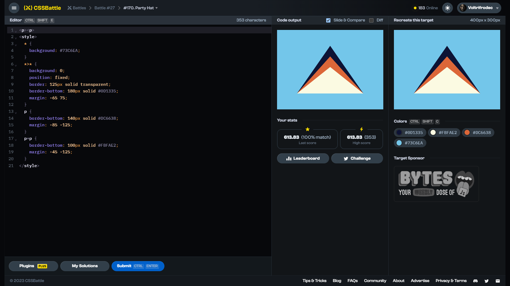

# Target #170: Party Hat

[Link to the target](https://cssbattle.dev/play/170)



<br>

```html
<p><p>
<style>
  * {
    background: #73C6EA;
  }
  *>* {
    background: 0;
    position: fixed;
    border: 125px solid transparent;
    border-bottom: 180px solid #0D1335;
    margin: -65 75;
  }
  p {
    border-bottom: 140px solid #DC6638;
    margin: -85 -125;
  }
  p+p {
    border-bottom: 100px solid #FBFAE2;
    margin: -45 -125;
  }
</style>
```

## Attempts
| Attempt | Score | Link |
|:-:|:-:|:-:|
| 1 | 613.83 {353}, 99.9% match | [Link to the solution](src/html/170_party-hat_attempt_01.html) |
| 2 | 616.90 {332}, 100.0% match | [Link to the solution](src/html/170_party-hat_attempt_02.html) |
| 3 | 644.25 {231}, 100.0% match | [Link to the solution](src/html/170_party-hat_attempt_03.html) |
